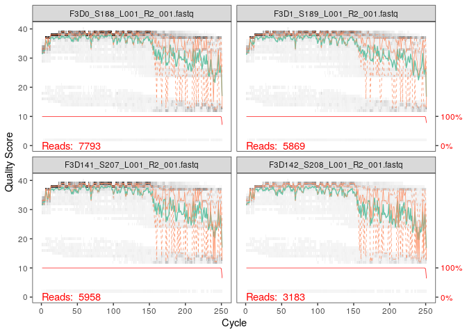

02\_data-analysis-with-DADA2
================
Irene Romero Rodríguez

  - [Création d’un objet.](#création-dun-objet.)
  - [Evaluation des profils de
    qualité.](#evaluation-des-profils-de-qualité.)
      - [Filtrage des résultats et trim (réduction ou
        découpage).](#filtrage-des-résultats-et-trim-réduction-ou-découpage.)
  - [Apprentissage des erreurs](#apprentissage-des-erreurs)
      - [Analyse des données: séquences
        répétées.](#analyse-des-données-séquences-répétées.)
  - [Alignement des R1 et R2 pour créer des
    contigs](#alignement-des-r1-et-r2-pour-créer-des-contigs)
  - [Construction d’une table
    d’observation:](#construction-dune-table-dobservation)
      - [Elimination des chimères.](#elimination-des-chimères.)
  - [Résumé des filtres de qualité](#résumé-des-filtres-de-qualité)
  - [Taxonomie.](#taxonomie.)
  - [Evaluation de la précision des
    analyses.](#evaluation-de-la-précision-des-analyses.)

Nous allons travailler ici avec DADA2 afin de traiter des données brutes
et, par la suite, les analyser. DADA2 est un package, dans ce package il
y a un ensemble de fonctions utilisées les unes après les autres qui
vont transformer les données brutes. Un Package met à disposition des
fonctions, mais c’est à nous de fabriquer le script qui utilise les
fonctions du package pour faire le traitement des données en
métabarcoding et pour faire des représentations graphiques par exemple.
Ici on ne va par utiliser un script simple mais un notebook. Un R
notebook est un script R plus intéressant sur lequel on execute des code
chunk (petites parties du code), de façn individuelle ou les uns à la
suite des autres. De même on peut rédiger des commentaires comme ce
paragraphe, chose que l’on va profiter afin de commenter les différentes
étapes que l’on va réaliser.

Nous allons travailler avec des échantillons codés par Illumina et qui
sont déjà démultiplexés. Produit final:Amplicon Sequence Variant (ASV).
L’objectif est aussi d’importer les données sur phyloseq (un autre
package de R) et analyser les données du microbiome.

On commence par importer la librairie contenant le package de DADA2.
Ensuite on crée un chemin vers les données téléchargées:

``` r
library(Rcpp)
library("dada2")
```

``` r
path <- "~/MiSeq_SOP" # CHANGE ME to the directory containing the fastq files after unzipping.
list.files(path)
```

    ##  [1] "F3D0_S188_L001_R1_001.fastq"   "F3D0_S188_L001_R2_001.fastq"  
    ##  [3] "F3D1_S189_L001_R1_001.fastq"   "F3D1_S189_L001_R2_001.fastq"  
    ##  [5] "F3D141_S207_L001_R1_001.fastq" "F3D141_S207_L001_R2_001.fastq"
    ##  [7] "F3D142_S208_L001_R1_001.fastq" "F3D142_S208_L001_R2_001.fastq"
    ##  [9] "F3D143_S209_L001_R1_001.fastq" "F3D143_S209_L001_R2_001.fastq"
    ## [11] "F3D144_S210_L001_R1_001.fastq" "F3D144_S210_L001_R2_001.fastq"
    ## [13] "F3D145_S211_L001_R1_001.fastq" "F3D145_S211_L001_R2_001.fastq"
    ## [15] "F3D146_S212_L001_R1_001.fastq" "F3D146_S212_L001_R2_001.fastq"
    ## [17] "F3D147_S213_L001_R1_001.fastq" "F3D147_S213_L001_R2_001.fastq"
    ## [19] "F3D148_S214_L001_R1_001.fastq" "F3D148_S214_L001_R2_001.fastq"
    ## [21] "F3D149_S215_L001_R1_001.fastq" "F3D149_S215_L001_R2_001.fastq"
    ## [23] "F3D150_S216_L001_R1_001.fastq" "F3D150_S216_L001_R2_001.fastq"
    ## [25] "F3D2_S190_L001_R1_001.fastq"   "F3D2_S190_L001_R2_001.fastq"  
    ## [27] "F3D3_S191_L001_R1_001.fastq"   "F3D3_S191_L001_R2_001.fastq"  
    ## [29] "F3D5_S193_L001_R1_001.fastq"   "F3D5_S193_L001_R2_001.fastq"  
    ## [31] "F3D6_S194_L001_R1_001.fastq"   "F3D6_S194_L001_R2_001.fastq"  
    ## [33] "F3D7_S195_L001_R1_001.fastq"   "F3D7_S195_L001_R2_001.fastq"  
    ## [35] "F3D8_S196_L001_R1_001.fastq"   "F3D8_S196_L001_R2_001.fastq"  
    ## [37] "F3D9_S197_L001_R1_001.fastq"   "F3D9_S197_L001_R2_001.fastq"  
    ## [39] "filtered"                      "HMP_MOCK.v35.fasta"           
    ## [41] "Mock_S280_L001_R1_001.fastq"   "Mock_S280_L001_R2_001.fastq"  
    ## [43] "mouse.dpw.metadata"            "mouse.time.design"            
    ## [45] "stability.batch"               "stability.files"

# Création d’un objet.

Les séquences avec lesquelles on travaille sont nommées par exemple
SAMPLENAME\_R1\_001.fastq et SAMPLENAME\_R2\_001.fastq. Ces fichiers
correspondent à la séquence forward et reverse de l’échantillon 1. On a
pareil pour le reste des échantillons. Nous allons donc créer des objets
fnFs et fnRs contenant l’ensemble des séquences forward et reverse
respectivement.

fnFs est une nouvelle variable à laquelle on assigne list.file (une
liste de fichiers), qui est une fonction sur r. Cette fonction nécessite
en premier le chemin pour trouver les fichiers, ici “path” que l’on
avait déjà crée. la fonction pattern va assigner une « expression
régulière » qui va être cherché lorsqu’on fait la recherche entre les
fichiers (l’étoile sur linux). On utilise par exemple \_R1001.fastq car
sur les noms des séquences on a XXX\_XXXX\_XXX\_R1\_001.fastq R1 et R2
car forward et reverse, read 1 et read 2. Ici la fonction sort va
permettre de prendre les fichiers des R1 et les classer par ordre
alphabétique. Ainsi fnFs est une liste avec tous les séquences forward.

``` r
fnFs <- sort(list.files(path, pattern="_R1_001.fastq", full.names = TRUE))
fnRs <- sort(list.files(path, pattern="_R2_001.fastq", full.names = TRUE))
# Extract sample names, assuming filenames have format: SAMPLENAME_XXX.fastq
sample.names <- sapply(strsplit(basename(fnFs), "_"), `[`, 1)
```

Sur la dernière ligne du code chunk nous avons crée sample.names qui est
une troisième variable qui prend le basename des fnFs, c’est-à-dire, le
nom du fichier sans le chemin. La fonction stringsplit coupe la chaîne
de caractères avec un délimiteur, ici le délimiteur est le tiret bas. Et
ensuite le premier morceau est sélectionné (1) soit F3D145, si on avait
mis 2 on aurait pris S197 par exemple (nom du fichier
F3D145\_S197\_XXXX\_R1\_001.fastq). La fonction sapply permet
d’appliquer le strsplit à tous les éléments de la liste.

# Evaluation des profils de qualité.

Ce graphique va nous permettre de voir, à l’aide d’un heatmap, la
fréquence de la qualité à chaque position donnée, pour un read, en
fonction du cycle.

``` r
plotQualityProfile(fnFs[1:2])
```

<!-- -->

Les deux graphiques du score de qualité sont ceux des deux premiers
échantillons sur la liste fnFs (échantillons S188 et S189). C’est la
commande \[1:2\] qui permet de voir les deux premières librairies. Donc
les deux premiers échantillons.Pour les reverse on va choisir les plots
de 1 à 4.Si on veut choisir que certains éléments de la liste il faut
fournir à R un vecteur avec les éléments sur lesquels on veut appliquer
la fonction. Le vecteur se crée avec la lettre c. donc fnRs\[c (1,4)\]
choisi juste les samples 1 et 4.

``` r
plotQualityProfile(fnRs[1:4])
```

<!-- -->

Par rapport aux résultats observés pour les read forward, le trimming
des derniers nucléotides peut être avantageux afin de diminuer les
sources d’erreur possibles qui peuvent être données en fin de
séquençage. Les profils des résultats de cette base de données
n’indiquent pas qu’il faut effectuer un trimming (ou trimming
additionnel) car ils sont de bonne qualité.

Dans le cas des reverse reads (fnFr) le profil de qualité est
significativement pire. DADA2 peut incorporer l’information de qualité
dans modèle d’erreur, ce qui entraîne une augmentation de la robustesse
face aux séquences de faible qualité. Cependant la sensibilité de
l’algorithme s’améliore si on effectue un trimming afin d’enlever les
séquences à plus faible qualité. Cette amélioration concerne notamment
les variants et séquences rares. En fonction du profil obtenu on va
tronquer à 160, là où commence la faible qualité. IMPORTANT : **APRÈS
TRIMMING IL EST IMPÉRATIVEMENT NÉCESSAIRE QUE LES READS FORWARD ET
REVERSE PUISSENT CHEVAUCHER.**

Si on veut juste prendre les échantillons 1 et 4 il faut créer un
vecteur sur lequel on indique sur quels échantillons on veut appliquer
la fonction:

``` r
plotQualityProfile(fnRs[c(1,4)])
```

<!-- -->

## Filtrage des résultats et trim (réduction ou découpage).

On crée un dossier où stocker les files filtrées (trimming effectué):

``` r
# Place filtered files in filtered/ subdirectory
filtFs <- file.path(path, "filtered", paste0(sample.names, "_F_filt.fastq.gz"))
filtRs <- file.path(path, "filtered", paste0(sample.names, "_R_filt.fastq.gz"))
names(filtFs) <- sample.names
names(filtRs) <- sample.names
```

Ensuite on procède à utiliser la fonction filterAndTrim du package de
Dada2 qui permet d’enlever les nucléotides ayant un pire score de
qualité. Pour ce faire on défini tout de même des paramètres standard
(maxN=0, truncQ=2, rm.phix=TRUE and maxEE=2) selon lesquels il faut
filtrer les reads. On va prendre les données de fnFs qui vont donner des
filtFs; des fnRs qui vont donner des filtRs. Et on va tronquer
respectivement au niveau de la position 240 et 160 afin d’enelver un
maximum de la séquence ayant un moins bon score de qualité. Cependant on
laise toujours une marge pour le chevauchement. D’autre part ici on a
pas de primers donc on en fait pas un trimLeft qui permet d’enlèver
aussi des bases en début de séquence.

``` r
out <- filterAndTrim(fnFs, filtFs, fnRs, filtRs, truncLen=c(240,160),
              maxN=0, maxEE=c(2,2), truncQ=2, rm.phix=TRUE,
              compress=TRUE, multithread=TRUE) # On Windows set multithread=FALSE
head(out)
```

    ##                               reads.in reads.out
    ## F3D0_S188_L001_R1_001.fastq       7793      7113
    ## F3D1_S189_L001_R1_001.fastq       5869      5299
    ## F3D141_S207_L001_R1_001.fastq     5958      5463
    ## F3D142_S208_L001_R1_001.fastq     3183      2914
    ## F3D143_S209_L001_R1_001.fastq     3178      2941
    ## F3D144_S210_L001_R1_001.fastq     4827      4312

    maxEE= nombre maximum d’erreurs attendues (expected errors) permises sur le read, ce qui est un meilleur filtre que juste le score moyen de qualité. Paramètres standars= points d’initiation et non pas des valeurs fixes. 

On obtient avec la variable out et son affichage (head) le nom de
fichier, le nombre de reads en entrée (reads in) et en reads out le
nombre de reads en sortie (donc après filtrage). La variable out est un
bilan de texte sur ce qui a été effectué (rapport d’activité de la
fonction filterAndTrim. La fonction filterAndTrim a pris les
échantillons de fnFs, les a filtré en créant des fichiers fastq filtFs,
donc qui vont être stockées sur le fichier qu’on a crée avant, car toute
donnée de ce type va là bas. Ainsi Creating output directory
/home/rstudio/MiSeq\_SOP/filtered est le moment où le dossier filtered
est crée car c’est avec la fonction filterAndTrim que l’on commence à
obtenir des fichiers filtFs.

# Apprentissage des erreurs

La méthode leanErrors apprend du modèle d’erreur à partir des données en
alternant l’estimation des taux d’erreur et inférence (conclusion) de la
composition de l’échantillon jusqu’à ce qu’ils convergent en une
solution conjointe. L’algorithme doit partir d’une base ou tentative
initiale sur combien d’erreurs possibles il peut y avoir dans les
données utilisées. On applique cette méthode sur les reads forward:

``` r
errF <- learnErrors(filtFs, multithread=TRUE)
```

    ## 33514080 total bases in 139642 reads from 20 samples will be used for learning the error rates.

et pour les reverse:

``` r
errR<- learnErrors(filtRs, multithread=TRUE)
```

    ## 22342720 total bases in 139642 reads from 20 samples will be used for learning the error rates.

Visualisation de ces modèles d’erreur:

``` r
plotErrors(errF, nominalQ=TRUE)
```

    ## Warning: Transformation introduced infinite values in continuous y-axis
    
    ## Warning: Transformation introduced infinite values in continuous y-axis

<!-- -->

plotErrors(errF,nominalQ=TRUE) permet de vérifier de façon graphique la
fréquence d’erreurs par rapport au consensus des scores de qualité.

Courbes qui ne sont pas la diagonale:probabilité que un A ait à être
changé par un C par exemple. Quand un score de qualité est haut, la
probabilité de changement d’une base par une autre est faible. Si le
score de qualité est faible, la probabilité que à cette position un, par
exemple C donne un A, est plus élevée.

## Analyse des données: séquences répétées.

Dans un jeu de données avec 10 séquences, on peut voir combien de
séquences sont présentées répétées donc une séq 2 fois et une autre 8
fois. Donc deux bactéries, une présente au 20% et la deuxième au 80%.

Dans ce cas on a beaucoup de reads donc une fonction permet de voir
combien de séquences uniques il y a. Or il peut avoir plusieurs
plasmides (jusqu’à 14 par bactérie). De plus il y a la profondeur de
séquençage à tenir en compte aussi \!

``` r
dadaFs <- dada(filtFs, err=errF, multithread=TRUE)
```

    ## Sample 1 - 7113 reads in 1979 unique sequences.
    ## Sample 2 - 5299 reads in 1639 unique sequences.
    ## Sample 3 - 5463 reads in 1477 unique sequences.
    ## Sample 4 - 2914 reads in 904 unique sequences.
    ## Sample 5 - 2941 reads in 939 unique sequences.
    ## Sample 6 - 4312 reads in 1267 unique sequences.
    ## Sample 7 - 6741 reads in 1756 unique sequences.
    ## Sample 8 - 4560 reads in 1438 unique sequences.
    ## Sample 9 - 15637 reads in 3590 unique sequences.
    ## Sample 10 - 11413 reads in 2762 unique sequences.
    ## Sample 11 - 12017 reads in 3021 unique sequences.
    ## Sample 12 - 5032 reads in 1566 unique sequences.
    ## Sample 13 - 18075 reads in 3707 unique sequences.
    ## Sample 14 - 6250 reads in 1479 unique sequences.
    ## Sample 15 - 4052 reads in 1195 unique sequences.
    ## Sample 16 - 7369 reads in 1832 unique sequences.
    ## Sample 17 - 4765 reads in 1183 unique sequences.
    ## Sample 18 - 4871 reads in 1382 unique sequences.
    ## Sample 19 - 6504 reads in 1709 unique sequences.
    ## Sample 20 - 4314 reads in 897 unique sequences.

``` r
dadaRs <- dada(filtRs, err=errR, multithread=TRUE)
```

    ## Sample 1 - 7113 reads in 1660 unique sequences.
    ## Sample 2 - 5299 reads in 1349 unique sequences.
    ## Sample 3 - 5463 reads in 1335 unique sequences.
    ## Sample 4 - 2914 reads in 853 unique sequences.
    ## Sample 5 - 2941 reads in 880 unique sequences.
    ## Sample 6 - 4312 reads in 1286 unique sequences.
    ## Sample 7 - 6741 reads in 1803 unique sequences.
    ## Sample 8 - 4560 reads in 1265 unique sequences.
    ## Sample 9 - 15637 reads in 3414 unique sequences.
    ## Sample 10 - 11413 reads in 2522 unique sequences.
    ## Sample 11 - 12017 reads in 2771 unique sequences.
    ## Sample 12 - 5032 reads in 1415 unique sequences.
    ## Sample 13 - 18075 reads in 3290 unique sequences.
    ## Sample 14 - 6250 reads in 1390 unique sequences.
    ## Sample 15 - 4052 reads in 1134 unique sequences.
    ## Sample 16 - 7369 reads in 1635 unique sequences.
    ## Sample 17 - 4765 reads in 1084 unique sequences.
    ## Sample 18 - 4871 reads in 1161 unique sequences.
    ## Sample 19 - 6504 reads in 1502 unique sequences.
    ## Sample 20 - 4314 reads in 732 unique sequences.

Ici par exemple il n’y a pas 1660 bactéries car il peut en avoir moins,
mais ayant plusieurs opérons 16S. Cela peut être dû à cause, d’un point
de vue évolutif, du fait que ce sont des bactéries opportunistes
capables de se développer très rapidement quand les conditions
favorables à leur niche se présentent. (Développement plus rapide pour
capter les ressources au plus vite possible). Si on assume qu’il y a un
ARN 16S par bactérie et que la profondeur du séquençage est suffisamment
bonne, dans ce cas oui on peut dire qu’il y a 1660 bactéries sur cet
échantillon.

La fonction dada crée des objets de classe dada. Ainsi comme R a la
caractéristique de créer des objets complexes, ici dada est un de ces
objets. Il faut le considérer comme un étagère contenant des variable;
séquences ; l’abondance à l’intérieur… il y a donc plein d’informations
au sein de la data frame, ainsi l’objet dadaFs stocke plein
d’informations des séquences comme l’abondance des séquences sur
l’échantillon etc. Sur l’environnement de travail si on observe le
contenu de l’objet on voit les différentes « étagères ».

``` r
dadaFs[[1]]
```

    ## dada-class: object describing DADA2 denoising results
    ## 128 sequence variants were inferred from 1979 input unique sequences.
    ## Key parameters: OMEGA_A = 1e-40, OMEGA_C = 1e-40, BAND_SIZE = 16

Ici on évalue l’étagère de la première armoire, étant l’armoire,
l’échantillon 1 de Fs. On avait vu que Fs avait 1979 séquences
uniques, dont 128 vraies variantes (erreurs de séquençage font qu’on
trouve 1979 séquences uniques, mais en réalité après corriger les
erreurs de séquençage, on remarque qu’il y en a en réalité que 128
séquences uniques). Dada2 corrige les séquences obtenues et détermine
aussi les erreurs par rapport aux abondances relatives des séquences.

Dada2 est un modèle probabiliste et peut donc corriger les séquences
mais cela peut aussi faire perdre des microvariants à cause de la
correction en fonction des abondances relatives. Les corrections
effectuées par dada2 se font en fonction des modèles d’erreur tracées
avant (les fréquences d’erreur en fonction du score de qualité pour la
probabilité de telle ou telle base à une position donnée). Ces modèles
d’erreur sont appliqués par dada2 pour identifier les vrais variants.

# Alignement des R1 et R2 pour créer des contigs

On effectue maintenant les contigs à partir des R1 et R2 (soit les
Forward et reverse). On rappelle qu’on utilise ici des données tirées de
Mothur MiSeq SOP. Ces données sont faites sur la région V4 qui a une
longueur de 253 pb. La longueur des reads est de 250 pb. Ainsi SUR CE
CAS PRÉCIS, même en enlevant des nucléotides lors du trimming on peut
faire un overlap (chevauchement). Nous pouvons donc faire le « Merge
paired reads » pour former les contigs.

On crée un objet mergers sur lequel on stocke les contigs.

``` r
mergers <- mergePairs(dadaFs, filtFs, dadaRs, filtRs, verbose=TRUE)
```

    ## 6551 paired-reads (in 106 unique pairings) successfully merged out of 6907 (in 199 pairings) input.

    ## 5025 paired-reads (in 100 unique pairings) successfully merged out of 5188 (in 156 pairings) input.

    ## 4973 paired-reads (in 80 unique pairings) successfully merged out of 5268 (in 166 pairings) input.

    ## 2595 paired-reads (in 52 unique pairings) successfully merged out of 2756 (in 109 pairings) input.

    ## 2553 paired-reads (in 60 unique pairings) successfully merged out of 2785 (in 119 pairings) input.

    ## 3622 paired-reads (in 53 unique pairings) successfully merged out of 4103 (in 157 pairings) input.

    ## 6079 paired-reads (in 81 unique pairings) successfully merged out of 6515 (in 198 pairings) input.

    ## 3961 paired-reads (in 90 unique pairings) successfully merged out of 4384 (in 188 pairings) input.

    ## 14231 paired-reads (in 143 unique pairings) successfully merged out of 15358 (in 351 pairings) input.

    ## 10526 paired-reads (in 120 unique pairings) successfully merged out of 11166 (in 279 pairings) input.

    ## 11156 paired-reads (in 137 unique pairings) successfully merged out of 11799 (in 298 pairings) input.

    ## 4329 paired-reads (in 84 unique pairings) successfully merged out of 4788 (in 180 pairings) input.

    ## 17431 paired-reads (in 153 unique pairings) successfully merged out of 17812 (in 272 pairings) input.

    ## 5850 paired-reads (in 81 unique pairings) successfully merged out of 6095 (in 159 pairings) input.

    ## 3716 paired-reads (in 86 unique pairings) successfully merged out of 3894 (in 147 pairings) input.

    ## 6865 paired-reads (in 99 unique pairings) successfully merged out of 7193 (in 187 pairings) input.

    ## 4430 paired-reads (in 67 unique pairings) successfully merged out of 4605 (in 127 pairings) input.

    ## 4574 paired-reads (in 100 unique pairings) successfully merged out of 4736 (in 172 pairings) input.

    ## 6094 paired-reads (in 109 unique pairings) successfully merged out of 6314 (in 172 pairings) input.

    ## 4269 paired-reads (in 20 unique pairings) successfully merged out of 4281 (in 28 pairings) input.

``` r
# Inspect the merger data.frame from the first sample
head(mergers[[1]])
```

    ##                                                                                                                                                                                                                                                       sequence
    ## 1 TACGGAGGATGCGAGCGTTATCCGGATTTATTGGGTTTAAAGGGTGCGCAGGCGGAAGATCAAGTCAGCGGTAAAATTGAGAGGCTCAACCTCTTCGAGCCGTTGAAACTGGTTTTCTTGAGTGAGCGAGAAGTATGCGGAATGCGTGGTGTAGCGGTGAAATGCATAGATATCACGCAGAACTCCGATTGCGAAGGCAGCATACCGGCGCTCAACTGACGCTCATGCACGAAAGTGTGGGTATCGAACAGG
    ## 2 TACGGAGGATGCGAGCGTTATCCGGATTTATTGGGTTTAAAGGGTGCGTAGGCGGCCTGCCAAGTCAGCGGTAAAATTGCGGGGCTCAACCCCGTACAGCCGTTGAAACTGCCGGGCTCGAGTGGGCGAGAAGTATGCGGAATGCGTGGTGTAGCGGTGAAATGCATAGATATCACGCAGAACCCCGATTGCGAAGGCAGCATACCGGCGCCCTACTGACGCTGAGGCACGAAAGTGCGGGGATCAAACAGG
    ## 3 TACGGAGGATGCGAGCGTTATCCGGATTTATTGGGTTTAAAGGGTGCGTAGGCGGGCTGTTAAGTCAGCGGTCAAATGTCGGGGCTCAACCCCGGCCTGCCGTTGAAACTGGCGGCCTCGAGTGGGCGAGAAGTATGCGGAATGCGTGGTGTAGCGGTGAAATGCATAGATATCACGCAGAACTCCGATTGCGAAGGCAGCATACCGGCGCCCGACTGACGCTGAGGCACGAAAGCGTGGGTATCGAACAGG
    ## 4 TACGGAGGATGCGAGCGTTATCCGGATTTATTGGGTTTAAAGGGTGCGTAGGCGGGCTTTTAAGTCAGCGGTAAAAATTCGGGGCTCAACCCCGTCCGGCCGTTGAAACTGGGGGCCTTGAGTGGGCGAGAAGAAGGCGGAATGCGTGGTGTAGCGGTGAAATGCATAGATATCACGCAGAACCCCGATTGCGAAGGCAGCCTTCCGGCGCCCTACTGACGCTGAGGCACGAAAGTGCGGGGATCGAACAGG
    ## 5 TACGGAGGATGCGAGCGTTATCCGGATTTATTGGGTTTAAAGGGTGCGCAGGCGGACTCTCAAGTCAGCGGTCAAATCGCGGGGCTCAACCCCGTTCCGCCGTTGAAACTGGGAGCCTTGAGTGCGCGAGAAGTAGGCGGAATGCGTGGTGTAGCGGTGAAATGCATAGATATCACGCAGAACTCCGATTGCGAAGGCAGCCTACCGGCGCGCAACTGACGCTCATGCACGAAAGCGTGGGTATCGAACAGG
    ## 6 TACGGAGGATGCGAGCGTTATCCGGATTTATTGGGTTTAAAGGGTGCGTAGGCGGGATGCCAAGTCAGCGGTAAAAAAGCGGTGCTCAACGCCGTCGAGCCGTTGAAACTGGCGTTCTTGAGTGGGCGAGAAGTATGCGGAATGCGTGGTGTAGCGGTGAAATGCATAGATATCACGCAGAACTCCGATTGCGAAGGCAGCATACCGGCGCCCTACTGACGCTGAGGCACGAAAGCGTGGGTATCGAACAGG
    ##   abundance forward reverse nmatch nmismatch nindel prefer accept
    ## 1       579       1       1    148         0      0      1   TRUE
    ## 2       470       2       2    148         0      0      2   TRUE
    ## 3       449       3       4    148         0      0      1   TRUE
    ## 4       430       4       3    148         0      0      2   TRUE
    ## 5       345       5       6    148         0      0      1   TRUE
    ## 6       282       6       5    148         0      0      2   TRUE

Pour le premier cas, sur 6907 reads, 6551 ont pu être merged, cela veut
dire qu’il y avait certains où soit R1 soit R2 manquait. Les 3961 reads
ont été merged en 106 contigs uniques (donc non repétés). Sur data frame
on peut voir cette séquence.

# Construction d’une table d’observation:

On construit maintenant une table d’observation à partir de ces contigs.
On peut faire ça grâce à la fonction makeSequenceTable et de l’objet
mergers. Ensuite on demande grâce à la fonction dim les dimensions de
cette table d’observation. Nous avons 20 rangées (nombre d’échantillons)
et 293 colonnes, correspondante aux séquences. Cette table permet de
voir la fréquence d’apparition de chaque séquence unique (au total 293)
au sein de chaque échantillon.

``` r
seqtab <- makeSequenceTable(mergers)
dim(seqtab)
```

    ## [1]  20 293

On veut voir tout de même la longueur en nucléotides de chaque une de
ces séquences. On contruit une table montrant la taille des séquences
qui sont sur la table seq tab. Une seule séquence a 251 nucléotides; 88
ont 252 nucléotides; 196 ont 253…

``` r
# Inspect distribution of sequence lengths
table(nchar(getSequences(seqtab)))
```

    ## 
    ## 251 252 253 254 255 
    ##   1  88 196   6   2

## Elimination des chimères.

Les fragment chimère sont formés par un début de séquence d’ARN16 et
continué part un fragment de l’ARN16s’ par exemple. A la fin il
ressemble à une séquence d’ARN16S normale, et a la même taille. Par
contre comme c’est un mélange il peut avoir un début de protéobactérie
et une fin de firmicute. Donc ça ne donne rien du tout… On peut enlever
ces chimères du jeu de données. Dada2 compare le début des séquences
rares aux début des séquences parents abondantes, et la fin à d’autres
séquences abondantes différentes à celle du début. Ainsi elle va
chercher et repérer les chimères. Cela peut se faire grâce à la fonction
removeBimeraDenovo, les résultats de ce “nettoyage” des données on va
les stocker sur une nouvelle table de données seqtab.nochim:

``` r
seqtab.nochim <- removeBimeraDenovo(seqtab, method="consensus", multithread=TRUE, verbose=TRUE)
```

    ## Identified 61 bimeras out of 293 input sequences.

``` r
dim(seqtab.nochim)
```

    ## [1]  20 232

On calcule alors le rapport de séquences sans chimères par rapport au
total de séquences trouvées dans un premier temps:

``` r
sum(seqtab.nochim)/sum(seqtab)
```

    ## [1] 0.964263

Ici sur les 293 séquences uniques il y a 61 chimères, soit 1/5. Mais
même si 293 séquences uniques, ces séquences uniques peuvent être
répétées, donc ça se trouve 61 chimères entre 10000. Mais quand même
61 des séquences uniques (donc en termes de séquences uniques) ce sont
beaucoup de chimères. Après avoir enlevées les chimères, si on fait le
ratio \[(293-61) /293\], on observe 0,96. Donc il y a 1-0,93 soit 0,035.
Soit 3,5% de séquences chimériques dans notre jeu de données. Si on
oublie d’enlever le primer des séquences, le nombre de chimères va
augmenter significativement car les primers qui sont identiques à toutes
les séquences vont être pris en compte \!

# Résumé des filtres de qualité

Nous allons créer une table permettant de suivre nombre de séquences à
chaque étape de filtration. On crée l’objet getN qui est fonction de x
(getN est une variable d’une fonction). Cette nouvelle fonction on va la
définir par la somme des getUniques.

getUniques ajoute les vecteurs issus de différentes fonctions. Donc
extrait les séquences uniques d’un extrait Dada. Donc on commence par
dadaFs ; dadaRs puis des merges puis la somme de chaque ligne de cette
table (donc des observations de chaque échantillon). Cbind permet de
créer une suite de valeurs par rapport aux valeurs sélectionnées.

Ainsi la table “track” est la concaténation de toutes ces données.

``` r
getN <- function(x) sum(getUniques(x))
track <- cbind(out, sapply(dadaFs, getN), sapply(dadaRs, getN), sapply(mergers, getN), rowSums(seqtab.nochim))
# If processing a single sample, remove the sapply calls: e.g. replace sapply(dadaFs, getN) with getN(dadaFs)
colnames(track) <- c("input", "filtered", "denoisedF", "denoisedR", "merged", "nonchim")
rownames(track) <- sample.names
head(track)
```

    ##        input filtered denoisedF denoisedR merged nonchim
    ## F3D0    7793     7113      6996      6978   6551    6539
    ## F3D1    5869     5299      5227      5239   5025    5014
    ## F3D141  5958     5463      5339      5351   4973    4850
    ## F3D142  3183     2914      2799      2833   2595    2521
    ## F3D143  3178     2941      2822      2868   2553    2519
    ## F3D144  4827     4312      4146      4224   3622    3483

On constate que l’on a pu garder la plupart de nos données brutes. De
même il n’y a pas une étape qui ait éliminé beuacoup de séquences d’un
seul coup.

# Taxonomie.

Dada2 va nous permettre d’assigner une taxonomie à chaque une des
séquences. Pour assigner une taxonomie il faut un algorithme ainsi
qu’une base de données de référence. L’assigneur vient d’un encodeur
de classification fait il y a longtemps, il va aller sur des bases de
données et regarder les séquences les plus proches afin d’assigner la
taxonomie. Pour faire tourner l’assignation il faut aller chercher la
base de données. Nous on va choisir silva138.

Ensuite avec la fonction assignTaxonomy, on se sert de la table de
seqtab.nochim et on assigne une taxonomie aux différentes séquences.

``` r
taxa <- assignTaxonomy(seqtab.nochim, "~/phyloseq_tuto/silva_nr99_v138_wSpecies_train_set.fa.gz", multithread=TRUE)
```

On choisi le fichier en fonction d’où il a été sauvegarde ; et quel lien
faut choisir (nom du fichier de données à ouvrir, ici
silva\_nr99\_wSpecies\_train\_set.fa.gz. Cette opération met très
longtemps car il y a beaucoup de séq à comparer avec beaucoup d’autres
séquences. Mais du coup on est entrain de créer un objet taxa où chaque
séquence est assignée à une taxonomie de la base de données. Ensuite il
faut imprimer ces résultats si on veut les voir, ainsi on crée
taxa.print où on assigne taxa. On marque qu’est ce que l’on veut en
colonne et en lignes et on lance le code. On obtient une matrice où on a
les taxonomies.

``` r
taxa.print <- taxa # Removing sequence rownames for display only
rownames(taxa.print) <- NULL
head(taxa.print)
```

    ##      Kingdom    Phylum         Class         Order           Family          
    ## [1,] "Bacteria" "Bacteroidota" "Bacteroidia" "Bacteroidales" "Muribaculaceae"
    ## [2,] "Bacteria" "Bacteroidota" "Bacteroidia" "Bacteroidales" "Muribaculaceae"
    ## [3,] "Bacteria" "Bacteroidota" "Bacteroidia" "Bacteroidales" "Muribaculaceae"
    ## [4,] "Bacteria" "Bacteroidota" "Bacteroidia" "Bacteroidales" "Muribaculaceae"
    ## [5,] "Bacteria" "Bacteroidota" "Bacteroidia" "Bacteroidales" "Bacteroidaceae"
    ## [6,] "Bacteria" "Bacteroidota" "Bacteroidia" "Bacteroidales" "Muribaculaceae"
    ##      Genus         Species     
    ## [1,] NA            NA          
    ## [2,] NA            NA          
    ## [3,] NA            NA          
    ## [4,] NA            NA          
    ## [5,] "Bacteroides" "caecimuris"
    ## [6,] NA            NA

On fait une deuxième assignation taxonomique à partir de silva species
assignment pour faire une assignation taxonomique au niveau de l’espèce
en se basant sur un match exact et les séquences de référence.

``` r
taxa<- addSpecies(taxa, "~/phyloseq_tuto/silva_species_assignment_v138.fa.gz")
```

``` r
taxa.print <- taxa # Removing sequence rownames for display only
rownames(taxa.print) <- NULL
head(taxa.print)
```

    ##      Kingdom    Phylum         Class         Order           Family          
    ## [1,] "Bacteria" "Bacteroidota" "Bacteroidia" "Bacteroidales" "Muribaculaceae"
    ## [2,] "Bacteria" "Bacteroidota" "Bacteroidia" "Bacteroidales" "Muribaculaceae"
    ## [3,] "Bacteria" "Bacteroidota" "Bacteroidia" "Bacteroidales" "Muribaculaceae"
    ## [4,] "Bacteria" "Bacteroidota" "Bacteroidia" "Bacteroidales" "Muribaculaceae"
    ## [5,] "Bacteria" "Bacteroidota" "Bacteroidia" "Bacteroidales" "Bacteroidaceae"
    ## [6,] "Bacteria" "Bacteroidota" "Bacteroidia" "Bacteroidales" "Muribaculaceae"
    ##      Genus         Species      Species
    ## [1,] NA            NA           NA     
    ## [2,] NA            NA           NA     
    ## [3,] NA            NA           NA     
    ## [4,] NA            NA           NA     
    ## [5,] "Bacteroides" "caecimuris" NA     
    ## [6,] NA            NA           NA

Ces résultats montrent une prédominance des Bacteroidota, ce qui est
plutôt normal du fait que ce phylum est composé par des bactéries Gram-,
anaérobies et don la classe Bacteroidia est prédominante dans les
excrements des animaux à sang chaud (comme les souris ou les rats).

# Evaluation de la précision des analyses.

Afin de pouvoir évaluer la précision des analyses effectuées, entre les
échantillons il y avait une mock community. Les mock community (ou
communautées simulées) sont des communautés artificielles qui ont été
crées en mélangeant diverses bactéries connues (ou virus; acides
nucléiques…) afin de simuler la composition d’un microbiome. Ainsi un
des échantillon ici est un mélange de 20 bactéries connues. Sur cette
partie on évalue les résultats obtenus par Dada2 par rapport aux
résultats que l’on attandait.

On crée donc un objet unqs.mock contenant les mocks tirés de la table
d’observation triée et sans chimères et ensuite on classifie les
élements de unqs.mock. Ensuite on mets un code concaténant un début et
une fin de phrase qui indique la longueur de unqs.mock qui correspond au
nombre de souches identifiées.

``` r
unqs.mock <- seqtab.nochim["Mock",]
unqs.mock <- sort(unqs.mock[unqs.mock>0], decreasing=TRUE) # Drop ASVs absent in the Mock
cat("DADA2 inferred", length(unqs.mock), "sample sequences present in the Mock community.\n")
```

    ## DADA2 inferred 20 sample sequences present in the Mock community.

Le résultat montre l’obtention de 20 communautés comme prévu, mais il
reste à savoir si ces communautés sont les communautées qui étaient
attendues. On compare alors avec les données de référence (que l’on
importe et assigne à l’objet mock.ref).

``` r
mock.ref <- getSequences(file.path(path, "HMP_MOCK.v35.fasta"))
match.ref <- sum(sapply(names(unqs.mock), function(x) any(grepl(x, mock.ref))))
cat("Of those,", sum(match.ref), "were exact matches to the expected reference sequences.\n")
```

    ## Of those, 20 were exact matches to the expected reference sequences.

Ce résultat indique que la méthode d’analyse de Dada2 est très bonne en
ce qui concerne la précision de assignations taxonomiques une fois que
les données ont été traitées. Tout ce package nous a donc permis de
faire un traitement de données de façon rapide et efficace. Cependant
ces données doivent être exploitées par la suite. Afin de faire cet
analyse de données nous allons travailler avec phyloseq.

Afin de pouvoir conserver l’environnement de travail, on le sauvegarde.
Ensuite, sur le notebook de phyloseq, on va importer cet environnement
de travail, ce qui va nous permettre de reprendre nos activités
d’analyse à partir des données déjà traitées et des objets crées sur
cette partie.
