03\_stat-analysis
================
Irene Romero Rodríguez

  - [Introduction: Packages](#introduction-packages)
  - [Objet phyloseq](#objet-phyloseq)
  - [L’alpha diversité](#lalpha-diversité)
      - [Ordination.](#ordination.)
      - [Graphique de barres (abondance
        relative).](#graphique-de-barres-abondance-relative.)
  - [Ajout d’échantillons](#ajout-déchantillons)
  - [Filtrage](#filtrage)
      - [Filtage taxonomique.](#filtage-taxonomique.)
      - [Filtration de prévalence.](#filtration-de-prévalence.)
  - [Arbre phylogénétique ou regroupement des
    taxons.](#arbre-phylogénétique-ou-regroupement-des-taxons.)
  - [Transformation des valeurs d’abondance (abondance vs abondance
    relative).](#transformation-des-valeurs-dabondance-abondance-vs-abondance-relative.)
      - [Sous-ensembles:Le retour du
        roi.](#sous-ensemblesle-retour-du-roi.)
  - [Analyse statistique avec R.](#analyse-statistique-avec-r.)
      - [Just kidding: il reste une étape de preparation
        JA.](#just-kidding-il-reste-une-étape-de-preparation-ja.)
      - [Ordinations.](#ordinations.)
  - [Analyses Graphiques.](#analyses-graphiques.)
      - [Graphiques comparant deux
        tests](#graphiques-comparant-deux-tests)
      - [Neighbors joining](#neighbors-joining)

``` r
library(rmarkdown)
library(knitr)
load("~/phyloseq_tuto/envmt_dada2.RData")
```

# Introduction: Packages

Nous allons continuer ici, à partir des données traitées avec dada2,
l’analyse de nos échantillons. Pour ce faire nous allons travailler
avec le package phyloseq ainsi que des packages permettant de tracer
diverses figures graphiques.

``` r
library(rmarkdown)
library(knitr)
library(phyloseq); packageVersion("phyloseq")
```

    ## [1] '1.32.0'

``` r
library(Biostrings); packageVersion("Biostrings")
```

    ## Loading required package: BiocGenerics

    ## Loading required package: parallel

    ## 
    ## Attaching package: 'BiocGenerics'

    ## The following objects are masked from 'package:parallel':
    ## 
    ##     clusterApply, clusterApplyLB, clusterCall, clusterEvalQ,
    ##     clusterExport, clusterMap, parApply, parCapply, parLapply,
    ##     parLapplyLB, parRapply, parSapply, parSapplyLB

    ## The following objects are masked from 'package:stats':
    ## 
    ##     IQR, mad, sd, var, xtabs

    ## The following objects are masked from 'package:base':
    ## 
    ##     anyDuplicated, append, as.data.frame, basename, cbind, colnames,
    ##     dirname, do.call, duplicated, eval, evalq, Filter, Find, get, grep,
    ##     grepl, intersect, is.unsorted, lapply, Map, mapply, match, mget,
    ##     order, paste, pmax, pmax.int, pmin, pmin.int, Position, rank,
    ##     rbind, Reduce, rownames, sapply, setdiff, sort, table, tapply,
    ##     union, unique, unsplit, which, which.max, which.min

    ## Loading required package: S4Vectors

    ## Loading required package: stats4

    ## 
    ## Attaching package: 'S4Vectors'

    ## The following object is masked from 'package:base':
    ## 
    ##     expand.grid

    ## Loading required package: IRanges

    ## 
    ## Attaching package: 'IRanges'

    ## The following object is masked from 'package:phyloseq':
    ## 
    ##     distance

    ## Loading required package: XVector

    ## 
    ## Attaching package: 'Biostrings'

    ## The following object is masked from 'package:base':
    ## 
    ##     strsplit

    ## [1] '2.56.0'

``` r
library(ggplot2); packageVersion("ggplot2")
```

    ## [1] '3.3.2'

``` r
library(dada2)
```

    ## Loading required package: Rcpp

``` r
library(DECIPHER)
```

    ## Loading required package: RSQLite

``` r
library(phangorn)
```

    ## Loading required package: ape

    ## 
    ## Attaching package: 'ape'

    ## The following object is masked from 'package:Biostrings':
    ## 
    ##     complement

rmarkdown est un package qui permet la création de documents dynamiques.
Grâce à ce package on peut créer des outputs qui peuvent être plus
ésthétiques. knitr est un package ayant plusieurs utilités cependant
ici on va l’utiliser avec la fonction knit avec le propos de créer un
document github à la fin. Quand on utilise cette fonction ce que l’on
est entraîn de faire est de prendre toutes les données entrées dans le
document; extraction du code en R suivant une liste de modèles et
rédigeant le résultat dans un document de sortie (output). Biostring
est un package permettant le traitement de données biologiques écrites
en chaîne de caractères. Cet outil va répertorier des grandes quantités
de chaînes de caractères, comme par exemple des séquences de nucléotides
et peut les comparer entre elles (un exemple de une des fonctions
contenues dans le package de Biostring). ggplot2 est un package
contenant des outils pour la création de graphiques suivant les
consignes de l’utilisateur: quel graphique est quoi; étiquettes;
couleurs… DECIPHER est un autre package de bioconductor (comme
Biostring) qui permet de curer, analyser et manipuler des séquences
biologiques (comme par exemple aligner des séquences). Finalement
phangorn est un package contenant des outils et méthodes permettant la
formation d’arbres phylogénetiques (comme Maximum likelihood ou Maximum
Parsimony).

*Fun fact*: Lors de la première séance de TP je me disais bien que
“phangorn” me disait quelque chose. C’est une excellente référence
(probablement…en tout cas je l’espère sinon je serai déçue) au Seigneur
des Anneaux. En effet la fôret de Treebeard (apparament Sylvebarbe en
français, Barbol en espagnol) est aussi nommée la fôret de *F*angorn
(avec F mais même prononciation). Ce qui est encore plus drôle c’est que
dans cette fôret on retrouve des êtres millenaires et anciens, donc la
ressemblence avec faire un arbre phylogénétique, qui permet de retrouver
les liens de parenté en fonction de l’évolution me paraît tout
simplement géniale. 10/10 à la personne qui a eu l’idée (j’espère qu’en
faisant exprès sinon s’il vous plaît ne me jugez pas, j’aime beaucoup
l’ouvrage, c’est tout).

# Objet phyloseq

Sur cette étape on va créer une data.frame qui est un tableau dans
lequel vont être repertoriées des informations des échantillons. Pour ce
faire on commence par créer un environnement de travail adéquat.

``` r
samples.out <- rownames(seqtab.nochim)
subject <- sapply(strsplit(samples.out, "D"), `[`, 1)
gender <- substr(subject,1,1)
subject <- substr(subject,2,999)
day <- as.integer(sapply(strsplit(samples.out, "D"), `[`, 2))
samdf <- data.frame(Subject=subject, Gender=gender, Day=day)
samdf$When <- "Early"
samdf$When[samdf$Day>100] <- "Late"
rownames(samdf) <- samples.out
```

On extrait l’information des rangées de la table où on a stocké nos
informations une fois que les chimères ont été éliminées. Ensuite on
change le nom de ces informations (échantillons) et on ajoute un D. Ces
nouveaux noms sont stockés sur l’objet subject. Ensuite on extrait
certaines des informations concernant ces subjects et on les assigne à
des objets nommés respectivement en fonction de l’information qu’ils
contiennent comme gender. On extrait aussi le jour. Ensuite on crée la
data frame qui va avoir en rangées les informations concernant aux
samples. En colonnes on va avoir le sujet; le genre; le jour et une
colonne pour spécifier si c’est un prélévement effectué tôt ou tard en
fonction des jours.

Ensuite on fait la construction d’un objet phyloseq à partir des
résultats de dada2:

``` r
ps <- phyloseq(otu_table(seqtab.nochim, taxa_are_rows=FALSE), 
               sample_data(samdf), 
               tax_table(taxa))
ps <- prune_samples(sample_names(ps) != "Mock", ps) # Remove mock sample
```

Cet objet phyloseq va contenir une table d’observation avec les OTU; les
informations extraites grâce à la data.frame et une table taxonomique.
De plus, on élimine la communauté mock.

On procede maintenant à attribuer des string chains plus courtes aux
noms des dossiers afin d’avoir plus de facilité pour travailler sur des
tableaux par exemple. On veut cependant garder la séquence en entier,
pour cela on va garder la séquence sur le refseq slot de l’objet et
renommer le taxa pour un nom plus court:

``` r
dna <- Biostrings::DNAStringSet(taxa_names(ps))
names(dna) <- taxa_names(ps)
ps <- merge_phyloseq(ps, dna)
taxa_names(ps) <- paste0("ASV", seq(ntaxa(ps)))
ps
```

    ## phyloseq-class experiment-level object
    ## otu_table()   OTU Table:         [ 232 taxa and 19 samples ]
    ## sample_data() Sample Data:       [ 19 samples by 4 sample variables ]
    ## tax_table()   Taxonomy Table:    [ 232 taxa by 8 taxonomic ranks ]
    ## refseq()      DNAStringSet:      [ 232 reference sequences ]

On voit ci-dessus l’objet ps et on a donc un bilan des tables formées
avec cet objet comme la table d’observation.

# L’alpha diversité

On utilise maintenant cet objet pour travailler avec phyloseq et faire
des études sur les données: On commence par l’alpha-diversité en traçant
les graphiques d’alpha diversité en fonction de l’indice de Shannon dans
un premier temps, et de Simpson deuxièmement. On distingue les deux
temps de l’échantillonnage qui sont regroupés par un changement de
couleur.

``` r
plot_richness(ps, x="Day", measures=c("Shannon", "Simpson"), color="When")
```

    ## Warning in estimate_richness(physeq, split = TRUE, measures = measures): The data you have provided does not have
    ## any singletons. This is highly suspicious. Results of richness
    ## estimates (for example) are probably unreliable, or wrong, if you have already
    ## trimmed low-abundance taxa from the data.
    ## 
    ## We recommended that you find the un-trimmed data and retry.

<!-- -->

La fonction plot richness permet d’estimer la richesse au sein des
échantillons et remets ces infos vers une figure ggplot2 (graphique).
Cette estimation est effectuée donc premièrement par des mesures en
applicant l’indice de Shannon puis de Simpson comme indiqué sur
l’assignation de measures. De plus on choisi de mettre des couleurs
qui vont être différents en fonction de la variable “When”. Ces données
tel quelles ne nous montrent pas vraiment de différence de richesse en
fonction du temps de l’échantillonnage. Il faut passer par une
ordination.

## Ordination.

On continue donc en effectuant une ordination pour l’étude par groupes:

``` r
# Transform data to proportions as appropriate for Bray-Curtis distances
ps.prop <- transform_sample_counts(ps, function(otu) otu/sum(otu))
ord.nmds.bray <- ordinate(ps.prop, method="NMDS", distance="bray")
```

    ## Run 0 stress 0.08574537 
    ## Run 1 stress 0.08574537 
    ## ... Procrustes: rmse 1.195072e-05  max resid 4.160432e-05 
    ## ... Similar to previous best
    ## Run 2 stress 0.08574537 
    ## ... Procrustes: rmse 3.35031e-06  max resid 9.034904e-06 
    ## ... Similar to previous best
    ## Run 3 stress 0.1264721 
    ## Run 4 stress 0.08002299 
    ## ... New best solution
    ## ... Procrustes: rmse 0.04283646  max resid 0.1433499 
    ## Run 5 stress 0.08574537 
    ## Run 6 stress 0.08574539 
    ## Run 7 stress 0.08942885 
    ## Run 8 stress 0.08574537 
    ## Run 9 stress 0.1319352 
    ## Run 10 stress 0.09421604 
    ## Run 11 stress 0.08002299 
    ## ... Procrustes: rmse 7.573056e-06  max resid 1.720055e-05 
    ## ... Similar to previous best
    ## Run 12 stress 0.08942883 
    ## Run 13 stress 0.09421603 
    ## Run 14 stress 0.08002299 
    ## ... Procrustes: rmse 4.293945e-06  max resid 1.438255e-05 
    ## ... Similar to previous best
    ## Run 15 stress 0.089429 
    ## Run 16 stress 0.121667 
    ## Run 17 stress 0.08574537 
    ## Run 18 stress 0.09421602 
    ## Run 19 stress 0.09421607 
    ## Run 20 stress 0.1216678 
    ## *** Solution reached

La première étape de ce code permet de transformer les valeurs trouvées
dans l’OTU (et grâce à celle ci) en abondances relatives. Ensuite on
crée une ordination avec ces mesures. La fonction ordinate permet de
créer cette ordination. Le choix d’ordination est ici NMDS (Non metric
multidimensinal scaling) qui est une méthode basée dans les rangs afin
de représenter la dissimilarité. On utilise la distance de Bray-Curtis
afin de mesurer la dissimilarité entre échantillons.

Et on trace le graphique de l’ordination:

``` r
plot_ordination(ps.prop, ord.nmds.bray, color="When", title="Bray NMDS")
```

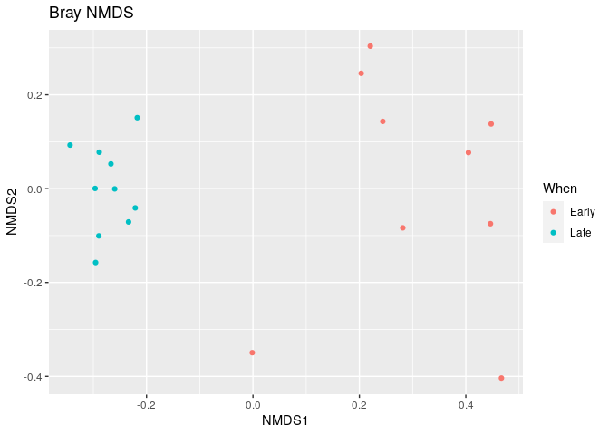<!-- -->

Grâce à cette ordination on observe en effet deux groupes bien distincts
détérminés par un échantillonnage fait tôt ou tard.

## Graphique de barres (abondance relative).

On finalise cette partie de l’étude en effectuant un graphique de barres
pour observer l’abondance relative des espèces en fonction de leur
groupe (Early ou late). On choisi les 20 plus abondantes:

``` r
top20 <- names(sort(taxa_sums(ps), decreasing=TRUE))[1:20]
ps.top20 <- transform_sample_counts(ps, function(OTU) OTU/sum(OTU))
ps.top20 <- prune_taxa(top20, ps.top20)
plot_bar(ps.top20, x="Day", fill="Family") + facet_wrap(~When, scales="free_x")
```

<!-- -->

On n’observe pas vraiment de différence sgnificative pouvant expliquer
la distinction en groupes.On peut à la limite dire qu’il y a légèrement
plus de Bacteriodaceae; Rikenellaceae et des NA dans les échantillons du
groupe early. Mais encore une fois les différences ne sont pas très
grandes comme pour pouvoir dire de façon sûre que ce soit à cause de ça.

# Ajout d’échantillons

Pour le reste du tutoriel phyloseq nous avons téléchargé des données
basées sur la même étude que depuis le début, mais ayant plus
d’échantillons. Ces données ont déjà été traitées.

``` r
ps_connect <-url("https://raw.githubusercontent.com/spholmes/F1000_workflow/master/data/ps.rds")
ps = readRDS(ps_connect)
ps
```

    ## phyloseq-class experiment-level object
    ## otu_table()   OTU Table:         [ 389 taxa and 360 samples ]
    ## sample_data() Sample Data:       [ 360 samples by 14 sample variables ]
    ## tax_table()   Taxonomy Table:    [ 389 taxa by 6 taxonomic ranks ]
    ## phy_tree()    Phylogenetic Tree: [ 389 tips and 387 internal nodes ]

# Filtrage

Dans cette partie nous allons filtrer nos données de travail. Cependant,
contrairement au filtrage fait sur la partie de DADA2 ici nous allons
filtrer grâce, d’une part de la taxonomie, et d’autre part en fonction
de la prévalence des taxons dans les échantillons.

## Filtage taxonomique.

Afin de pouvoir faire un filtrage et ne pas tenir en compte les espèces
moins abondantes qui peuvent être issues d’erreurs de séquençage on
commence par analyser les rangs puis ensuite on choisi un niveau auquel
on veut étudier pour filtrer nos échantillons.

### Rangs dans le jeu de données.

``` r
rank_names(ps)
```

    ## [1] "Kingdom" "Phylum"  "Class"   "Order"   "Family"  "Genus"

Ici on voit que l’on a des données allant depuis Kingdom (Domaine)
jusqu’au genus. Nous allons évaluer l’abondance présente dans chaque
phylum; pour cela on reprend la table de données taxonomiques crée avec
phyloseq et stockée dans l’objet phyloseq ps.

``` r
# Create table, number of features for each phyla
table(tax_table(ps)[, "Phylum"], exclude = NULL)
```

    ## 
    ##              Actinobacteria               Bacteroidetes 
    ##                          13                          23 
    ## Candidatus_Saccharibacteria   Cyanobacteria/Chloroplast 
    ##                           1                           4 
    ##         Deinococcus-Thermus                  Firmicutes 
    ##                           1                         327 
    ##                Fusobacteria              Proteobacteria 
    ##                           1                          11 
    ##                 Tenericutes             Verrucomicrobia 
    ##                           1                           1 
    ##                        <NA> 
    ##                           6

On observe grâce à cette table qu’il y a plusieurs phylums dans lesquels
on n’observe qu’une seul élément caractéristique à ces phylums dans les
échantillons. Du fait de leur faible abondance ces phylums seraient
intéressants à filtrer. Cependant ici on se centre plutôt sur les 6 NA.
En fait on s’est placé au niveau du Phylum parceque justement c’est un
ordre supérieur de classification. On sait que l’on travaille ici avec
des bactéries, donc étudier au niveau du domaine n’est pas intéressant.
Cependant au niveau du Phylum on observe quand même que l’on a des
séquences auxquelles on ne peut pas attribuer une taxonomie. A moins
d’être entraîn de travailler dans un projet innovateur de séquençage
voulant trouver des souches bactériennes nouvelles (et encore il
faudrait se méfier), et ici ce n’est pas le cas, ces séquences sont
probablement issues d’artifacts.

On va donc enlever les “NA” d’entre nos séquences:

``` r
ps <- subset_taxa(ps, !is.na(Phylum) & !Phylum %in% c("", "uncharacterized"))
```

Maintenant on va faire un étude de prévalence pour ensuite filtrer ces
mêmes données de prévalence:

``` r
# Compute prevalence of each feature, store as data.frame
prevdf = apply(X = otu_table(ps),
               MARGIN = ifelse(taxa_are_rows(ps), yes = 1, no = 2),
               FUN = function(x){sum(x > 0)})
# Add taxonomy and total read counts to this data.frame
prevdf = data.frame(Prevalence = prevdf,
                    TotalAbundance = taxa_sums(ps),
                    tax_table(ps))
```

Grâce à la fonction apply nous allons créer un objet prevdf dans lequel
nous allons extraire le nombre de fois qu’un phylum apparait sur un
échantillon en prennant en compte qu’il doit apparaitre au moins une
fois (x\>0). Ensuite on crée une table de données (data frame) contenant
la prévalence définie sur prevdf avant, ainsi que l’abondance totale
(somme des taxa de l’objet ps) et la table taxonomique de ps.

``` r
plyr::ddply(prevdf, "Phylum", function(df1){cbind(mean(df1$Prevalence),sum(df1$Prevalence))})
```

    ##                         Phylum         1     2
    ## 1               Actinobacteria 120.15385  1562
    ## 2                Bacteroidetes 265.52174  6107
    ## 3  Candidatus_Saccharibacteria 280.00000   280
    ## 4    Cyanobacteria/Chloroplast  64.25000   257
    ## 5          Deinococcus-Thermus  52.00000    52
    ## 6                   Firmicutes 179.24771 58614
    ## 7                 Fusobacteria   2.00000     2
    ## 8               Proteobacteria  59.09091   650
    ## 9                  Tenericutes 234.00000   234
    ## 10             Verrucomicrobia 104.00000   104

Grâce à la fonction plyr::ddply nous avons crée une table/matrice. Grâce
à la fonction cbind on donne des instructions à la fonction ddply de
calculer les moyenne des prévalences dans les échantillons (qui vont
apparaître en une première colonne) et la somme des prévalence dans les
échantillons, c’est à dire le nombre de fois total dans lequel on
retrouve des séquences appartenant à un tel ou un autre phylum entre
tous les échantillons (prévalence totale, qui apparaît dans la deuxième
colonne). Avant le cbind on choisi de faire cette matrice sur les
données du Phylum de l’objet prevdf.

On observe sur la table sur laquelle on a évaluée les abondances
respectives de données en fonction du que en effet il y a dans 13
écahntillons des éléments de actinobacteria, si on divise le nombre
total de séquences d’actinobactéria (prévalence totale) par la
prévalence moyenne on trouve 13 soit le nombre total d’échantillons
dans lesquels ça apparait. On observe pour fusobacteria qu’il y a que 2
séquences ayant en plus une fréquence d’apparition de 1% donc c’est
probablement deux séquences issues d’erreurs de séquençage. Surtout en
comparant au nombre d’apparition d’autres séquences. Quant à
Deinococcus; Verrumicrobia et Tenericutes il y a quand même une quantité
de prévalence de la sequence plutôt importante. Cependant on va enlever
les deinococcus pour l’exemple même si comme ça apparait 52 fois ça
commence a être possible que ce soit une bactérie qui apparait en très
petite quantité car elle est pas abondante dans le milieu de
prélevement.

Nous avons donc vu et décidé qu’il faut enlever les séquences
correspondants aux phylum Fusobacteria et Deinococcus-Thermus. On crée
un nouveau objet filterPhyla dans lequel on garde ces séquences, puis
grâce à la fonction subset\_taxa on enlève de ps ces données, et on
stocke le résultat dans un nouveau objet phyloseq:ps1.

``` r
# Define phyla to filter
filterPhyla = c("Fusobacteria", "Deinococcus-Thermus")
# Filter entries with unidentified Phylum.
ps1 = subset_taxa(ps, !Phylum %in% filterPhyla)
ps1
```

    ## phyloseq-class experiment-level object
    ## otu_table()   OTU Table:         [ 381 taxa and 360 samples ]
    ## sample_data() Sample Data:       [ 360 samples by 14 sample variables ]
    ## tax_table()   Taxonomy Table:    [ 381 taxa by 6 taxonomic ranks ]
    ## phy_tree()    Phylogenetic Tree: [ 381 tips and 379 internal nodes ]

## Filtration de prévalence.

Nous avons maintenant des données de prévalence en fonction du Phylum.
Cependant on peut encore filtrer ces données. On commence par
sélectioner les données de prévalence de l’objet ps1 en se centrant que
sur le Phylum. Ensuite on trace des graphiques: graphique par Phylum sur
lesquels on donne des paramètres aesthetiques dans lesquelles on veut
dans l’axe x l’abondance totale; en axe y la prévalence au sein du
phylum des échantillons de ps et on veut une couleur par phylum. On
choisit de même de rajouter une ligne à 0,05 soit 5% de prévalence dans
les divers phylums, cette ligne est une ligne de type 2 (non continue)
et d’opacité (alpha) 0,5 afin qu’elle ne perturbe pas trop la lecture du
graphique. On définit les paramètres concernant les points du graphique
(épaisseur du point avez size et l’alpha), puis on précise que l’on
trace un graphique en échelle logarithmique 10. De plus on ajoute des
titres d’axe mais on enlève les légendes des graphiques (vu que l’on
veut un graphique par Phylum).

``` r
# Subset to the remaining phyla
prevdf1 = subset(prevdf, Phylum %in% get_taxa_unique(ps1, "Phylum"))
ggplot(prevdf1, aes(TotalAbundance, Prevalence / nsamples(ps),color=Phylum)) +
  # Include a guess for parameter
  geom_hline(yintercept = 0.05, alpha = 0.5, linetype = 2) +  geom_point(size = 2, alpha = 0.7) +
  scale_x_log10() +  xlab("Total Abundance") + ylab("Prevalence [Frac. Samples]") +
  facet_wrap(~Phylum) + theme(legend.position="none")
```

<!-- -->

On observe que en effet il y a aux alentours de 17-18 points au total
entre les divers graphiques qui sont sous le seuil de 5% de prévalence.
Nous allons donc choisir de les enlever afin de d’utiliser des données
que l’on considère vont Être suffissament fiables. Ce filtrage que l’on
est entrain d’effectuer est un filtrage “sans supervision”. En effet,
depuis le début du tutoriel on travaille avec des séquences que l’on
filtre à base de comparaisons à des bases de données; entre elles etc.
Mais la on choisi quoi filtrer par rapport à ce qui nous conviens et
d’après ce que l’on voit (même si on a filré le score de qualité en
faisant un choix, on a basé le choix sur un calcul et des comparaisons
faites entre les séquences elles mêmes par rapport à leur technique de
séquençage).

On définit donc la prévalence comme valable à partir du seuil de 5% de
présence:

``` r
# Define prevalence threshold as 5% of total samples
prevalenceThreshold = 0.05 * nsamples(ps)
prevalenceThreshold
```

    ## [1] 18

Ensuite on crée un nouveau objet phyloseq, ps2, dans lequel on stocke
toutes les séquences que l’on garde, c’est à dire, les séquences
au-dessus du seuil de prévalence (keepTaxa).

``` r
# Execute prevalence filter, using `prune_taxa()` function
keepTaxa = rownames(prevdf1)[(prevdf1$Prevalence >= prevalenceThreshold)]
ps2 = prune_taxa(keepTaxa, ps)
```

# Arbre phylogénétique ou regroupement des taxons.

Même si il serait plus pratique de créer une agroupation des bactéries
par leur fonction, dû à la simplicité, nous allons faire un arbre
phylogénétique basé sur la similarité de taxonomie des bactéries des
échantillons. Pour ce faire nous devons donner des instructions afin de
créer un arbre classant les bactéries en fonction de leur appartenence à
un même genre:

``` r
# How many genera would be present after filtering?
length(get_taxa_unique(ps2, taxonomic.rank = "Genus"))
```

    ## [1] 49

Cette dernière commande nous a servi à évaluer la quantité de genres
bactériens différents présents dans nos échantillons après tous les tris
que l’on a effectué. On en a 49. On crée un objet phyloseq ps3 dans
lequel on va “merge” soit fusionner nos résultats jusqu’à un certain
niveau taxonomique; ici en l’ocurrence jusqu’au genre bactérien. Ainsi
la fonction tax\_glom permet de faire cette fusion pour créer les noeuds
de notre arbre.

``` r
ps3 = tax_glom(ps2, "Genus", NArm = TRUE)
```

L’arbre phylogénetique basé sur la taxonomie n’est pas mal, or il se
peut que nos séquences ne soient pas suffissament bonnes et
l’assignation taxonomique soit compliquée. Ou bien il se peut qu’on ne
dispose pas de ces informations taxonomiques. Ainsi on peut faire un
arbre sur une méthode similaire au clustering d’OTUs mais il y a une
composante évolutionnaire entre les séquences qui est tenue en compte.
En effet on va créer un arbre en se basant sur la distance
phylogenetique entre les éléments caractéristiques définissant un groupe
taxonomique. Pour faire cela on défini tout d’abord un indice de
similiarité au au dessous duquel on ne joins pas deux branchest et au
dessus du quel on considère que deux séquences sont suffissament
proches. Cet indice ici va être nommé h1. Ensuite on crée un objet
phyloseq, ps4, qui va contenir l’union d’éléments basée sur la distance
(hauteur) h.

``` r
h1 = 0.4
ps4 = tip_glom(ps2, h = h1)
```

C’est le moment de tracer notre arbre. Afin de pouvoir comparer nos
résultats on va tracer un arbre avec nos données avant d’avoir été
traitées pour fusionner en fonction de la taxonomie ou bien en fonction
de leur distance; puis un arbre pour la fusion taxonomique et un autre
pour la fusion par distance. On décide donner des titres aux arbres pour
ne pas les confondre et on indique que la taille de police des titres
est 15. Ensuite on crée p2tree avec la fonction plot\_tree, cette
fonction va tracer l’arbre de l’objet ps2 (données sans traiter) avec la
méthode treeonly, cette partie de la fonction indique si l’on veut des
annotations sur notre arbre ou pas (points de robustesse). L’option de
ladderize permet de reorganiser les noeuds des arbres en fonction de
leur profondeur par rapport aux nombre de branches qui partent d’un
noeuf et leur profondeur (un noeu où une branche donné issue à un autre
noeud puis un autre etc…). Le deuxième arbre est crée à partir de ps3 et
donc des données fusionnées par taxonomie et l’arbre trois en fonction
de l’hauteur (distance), donc à partir de l’objet ps4.

``` r
multiPlotTitleTextSize = 15
p2tree = plot_tree(ps2, method = "treeonly",
                   ladderize = "left",
                   title = "Before Agglomeration") +
  theme(plot.title = element_text(size = multiPlotTitleTextSize))
p3tree = plot_tree(ps3, method = "treeonly",
                   ladderize = "left", title = "By Genus") +
  theme(plot.title = element_text(size = multiPlotTitleTextSize))
p4tree = plot_tree(ps4, method = "treeonly",
                   ladderize = "left", title = "By Height") +
  theme(plot.title = element_text(size = multiPlotTitleTextSize))
```

On utilise ensuite la fonction gridExtra pour tracer les trois arbres
sur une même ligne.

``` r
library(gridExtra)
```

    ## 
    ## Attaching package: 'gridExtra'

    ## The following object is masked from 'package:BiocGenerics':
    ## 
    ##     combine

``` r
# group plots together
grid.arrange(nrow = 1, p2tree, p3tree, p4tree)
```

<!-- -->

Avant de fusionner nos données on obtient un arbre qui a beaucoup de
branches et qui est pratiquement ilisible. Après fusion de données on
constate que l’arbre se basant sur la distance des séquences permet de
donner plus de précisions que l’arbre basé sur la taxonomie mais tout en
restant plus clair et lisible que celui des données non traitées.

# Transformation des valeurs d’abondance (abondance vs abondance relative).

Nous allons sur cette partie, créer tout d’abord une fonction:
plot\_abondance. Cette fonction on va la définir à partir des variables
trouvables sur l’objet physeq, et on va assimiler à repartir (facet) les
graphiques en fonction de l’Ordre au sein des Firmicutes (on choisi les
firmicutes du fait que c’est le phyllum contenant plus de
caractéristiques cf. tax\_table de la partie Rangs dans le jeu de
données.)

``` r
plot_abundance = function(physeq,title = "", 
                          Facet = "Order", Color = "Phylum"){
  # Arbitrary subset, based on Phylum, for plotting
  p1f = subset_taxa(physeq, Phylum %in% c("Firmicutes"))
  mphyseq = psmelt(p1f)
  mphyseq <- subset(mphyseq, Abundance > 0)
  ggplot(data = mphyseq, mapping = aes_string(x = "sex",y = "Abundance",
                              color = Color, fill = Color)) +
    geom_violin(fill = NA) +
    geom_point(size = 1, alpha = 0.3,
               position = position_jitter(width = 0.3)) +
    facet_wrap(facets = Facet) + scale_y_log10()+
    theme(legend.position="none")
}
```

Cette fonction va, dans un premier temps attribuer à un nouveau objet,
p1f, les éléments du phylum Firmicutes de l’objet physeq (extraction des
données). Ensuite et grâce à la fonction psmelt noous allons créer un
table unique qui mets en relation toutes les informations, concenrant
les firmicutes, des différentes tables (OTU; taxa; data.frame). Cela va
être attibué à mphyseq. Ensuite on va faire le tri sur mphyseq pour
conserver que tout ce qui a une abondance supérieure à 0. Finalement la
fonction va permettre la création d’un graphique avec les données de
mphyseq. On va définir le caractère esthétique de la chaîne de
caractères et la cartographie des points. Nous allons donc tracer des
graphiques de distribution de l’abondance en fonction du sexe du rat sur
lequel a été effectué l’échantillonnage. Ensuite on introduit des
paramètres graphiques, on veut chaque séquence représentée par des
points de taille 1 plutôt peu opaques (afin de mieux voir les
superpositions par une couleur plus importante) et en plus on rajoute un
paramètre position\_jitter qui permet d’écarter lègerement les points
(sur l’axe x pour nous) afin de mieux voir le positionnement des points.
On ajoute de même des données pour créer un graphique en violon (violin
plot). Le violin plot permet de déterminer les données qui pourraient
être lues grâce à une boîte à moustache mais on rajoute de même de
façon visuelle le paramètre de densité aléatoire (la distribution des
données). Ici on va tracer le graphique en violon uniquement avec les
traits afin de voir la densité de points à chaque niveau mais sans voir
les données de la boîte à moustache. On mets pas de filling sur le
graphique afin de tout simplement lire les points. Finalement on
détermine l’utilisation d’une échelle logarithmique et avec facet\_wrap
on donne ordre d’utiliser des graphiques montrant la facette choisie,
c’est à dire, celle que l’on a défini en début de fonction: l’ordre au
sein des phylums (et dans ce cas et par rapport au code que l’on a fait,
on demande les graphiques des différents ordres retrouvés au sein des
Firmicutes).

Une fois que l’on a crée cette fonction qui va nous permettre de tracer
des graphiques, on choisi les données à utiliser. On va donc transformer
nos données afin de traiter la fréquence des échantillons. Pour ce faire
il faut utiliser la fonction transform\_sample\_counts.

``` r
# Transform to relative abundance. Save as new object.
ps3ra = transform_sample_counts(ps3, function(x){x / sum(x)})
```

Nous avons donc indiqué de transformer les données de l’objet ps3 avec
une fonction permettant de calculer la fréquence de chaque séquence (x
divisé par la somme des x). Ces fréquences sont stockées sur ps3ra. On
trace des graphiques avant le traitement des données (à partir de ps3)
et après traitement (à partir de ps3ra).

``` r
plotBefore = plot_abundance(ps3,"")
plotAfter = plot_abundance(ps3ra,"")
# Combine each plot into one graphic.
grid.arrange(nrow = 1,  plotBefore, plotAfter)
```

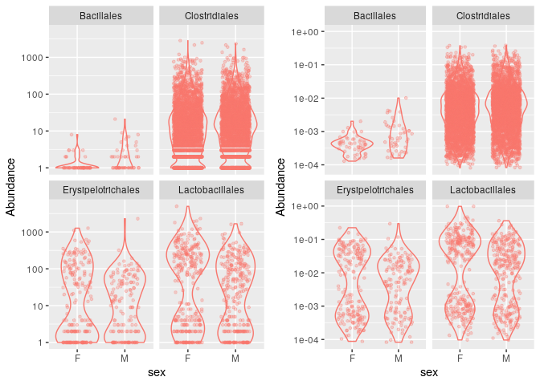<!-- -->

``` r
#sur le code du tutoriel on mets nrow=2 mais ici on change par 1 afin d'avoir quelque chose de plus esthetique et lisible
```

Sur le côte gauche on observe donc les abondances des séquences des
firmicutes . Sur les graphiques de droite on observe les données
traitées qui nous donnent les abondances relatives. En effet en ps3 on
observe quelle quantité de de séquences de chaque groupe il y a au sein
de l’ensemble des échantillons. Sur ps3ra en calculant la fréquence, on
calcule l’abondance relative. Afin d’interpreter de violin plot, on doit
tenir en compte la symétrie de la figure. Si on trace un ligne juste au
centre de symétrie de la figure et que l’on effectue une rotation de la
figure prenant ce centre comme axe x on observe la distribution au sein
des différents ordres et la prédominance (c’est la frome qui aurait la
distribution si on aurait utilisé par exemple un histogramme avec les
familles au sein de cet ordre).

## Sous-ensembles:Le retour du roi.

Sur cette partie nous allons encore une fois travailler sur des
sous-ensembles de données pour les évaluer. Plus précisement on va faire
une analyse des sous-ensembles taxonomiques trouvés dans les
firmicutes.Et encore plus précisement on va se centrer sur l’ordre des
Lactobacillales. Pourquoi? En fait si on observe les violin plot de la
partie précedente on observe que la distribution des Lactobacillales (et
celle des Erisipelotriarchales) est pas unimodale mais bimodale. C’est à
dire, on a deux bosses donc on a deux genres qui prédominent.Lesquels?
On va se servir de la fonction plot\_abundance que l’on a défini sur la
partie précedente et on va tracer les représentations graphiques des
genres contenus chez les Lactobacillales avec l’abondance en fonction du
sexe. On crée un objet psOrd auquel on assigne les éléments de l’ordre
des Lactobacillales qui sont stockées dans l’objet ps3ra (donc on
travaille uniquement avec l’abondance relative). Ensuite on trace le
graphique mais cette fois en changeant facet pour demander le “Genus” ou
genre.

``` r
psOrd = subset_taxa(ps3ra, Order == "Lactobacillales")
plot_abundance(psOrd, Facet = "Genus", Color = NULL)
```

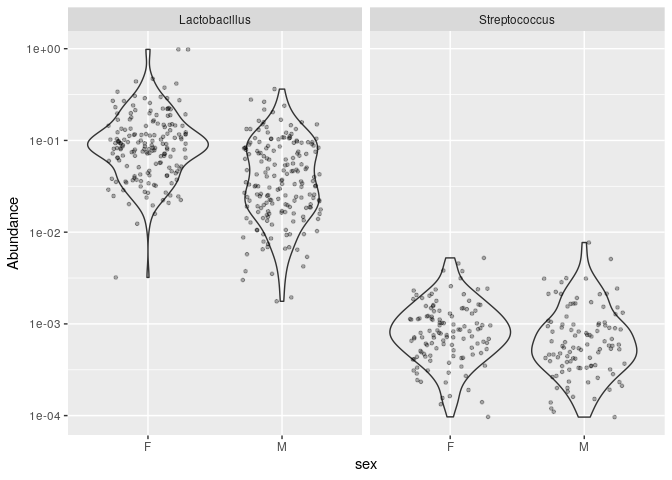<!-- -->

On constate que en effet la distribution bimodale était due à deux
genres au sein des Lactobacillales, les Lactobacillus et les
Streptocoques. On remarque tout de même que les Lactobacillus sont plus
abondants que les Streptocoques. De façon résumée sur cette étape ce que
l’on a fait c’est décomposer le graphique des Lactobacillales de la
partie précedente en deux en fonction du genre. Après ajout de packages,
et en ayant fini les tris des séquences et leur traitement… On passe à
l’analyse statistique.

# Analyse statistique avec R.

## Just kidding: il reste une étape de preparation JA.

On crée un petit graphique (histogramme) en prennant uniquement les âges
des souris sur lesquelles on a échantillonné.

``` r
qplot(sample_data(ps)$age, geom = "histogram",binwidth=20) + xlab("age")
```

<!-- --> On
observe qu’il y a trois groupes d’âge. Il serait donc intéressant de
lier les analyses et données à l’âge plutôt qu’à l’échantillon. On doit
tout de même vérifier si les données sont comparables, soit si elles
sont normalisées:

``` r
qplot(log10(rowSums(otu_table(ps))),binwidth=0.2) +
  xlab("Logged counts-per-sample")
```

<!-- -->

Il semble qu’une normalisation par la fonction log(x+1) est suffissante.
Nous allons donc créer un code permettant de lier l’âge des souris aux
analyses, ensuite on va faire une PCoA afin d’avoir un premier apperçu
de nos données. On commence par decomposer nos données à partir de l’âge
grâce à la fonction cut. On coupe au niveau des jours 100; 200 et 400.
Ainsi on va créer des niveaux au sein de nos données en les classant sur
ces intervalles et en les triant en “Young100”; “Mid100to200” et
“Old200”. On crée aussi un lien avec la parenté entre les souris
utilisées pour l’étude. Ensuite on normalise les données grâce à
transform\_sample\_counts, avec la fonction log(1+x) et on attribue ces
valeurs normalisées à pslog. Ensuitre on crée une ordination de ces
données normalisées, la PCoA (MDS) utilisant l’indice de distances
wunifrac. Cette ordination est stockée en out.wuf.log, les coefficients
permettant de trouver les vecteurs (Eigenvalue des eigenvectors)est
assigné à evals. Finalement on trace l’ordination et on assigne aux
données des couleurs en fonction de l’âge.

``` r
sample_data(ps)$age_binned <- cut(sample_data(ps)$age,
                              breaks = c(0, 100, 200, 400))
levels(sample_data(ps)$age_binned) <- list(Young100="(0,100]", Mid100to200="(100,200]", Old200="(200,400]")
sample_data(ps)$family_relationship=gsub(" ","",sample_data(ps)$family_relationship)
pslog <- transform_sample_counts(ps, function(x) log(1 + x))
out.wuf.log <- ordinate(pslog, method = "MDS", distance = "wunifrac")
```

    ## Warning in UniFrac(physeq, weighted = TRUE, ...): Randomly assigning root as --
    ## GCAAGCGTTATCCGGATTTACTGGGTGTAAAGGGAGCGTAGGCGGTGCGCCAAGCTGGGTGTGAAAGGCCGGGGCTCAACCCCGGGACTGCACTCGGAACTGGCGTGCTAGAGTGTTGGAGAGGTAAGCGGAATTCCTAGTGTAGCGGTGAAATGCGTAGATATTAGGAGGAACACCAGTGGCGAAGGCGGCTTACTGGACAATAACTGACGCTGAGGCTCGAAAGCGTGGGGAG
    ## -- in the phylogenetic tree in the data you provided.

``` r
evals <- out.wuf.log$values$Eigenvalues
plot_ordination(pslog, out.wuf.log, color = "age_binned") +
  labs(col = "Binned Age") +
  coord_fixed(sqrt(evals[2] / evals[1]))
```

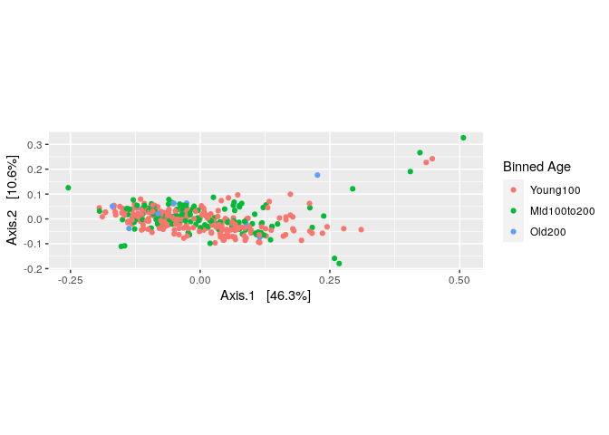<!-- -->

On observe quelques données qui peuvent induire à erreur (plus écartées
du reste et qui peuvent avoir encore des problèmes). On analyse les
données de ces points en les comparant.

``` r
  rel_abund <- t(apply(otu_table(ps), 1, function(x) x / sum(x)))
qplot(rel_abund[, 12], geom = "histogram",binwidth=0.05) +
  xlab("Relative abundance")
```

<!-- -->

## Ordinations.

On élimine les points qui sont plus écartés sur la PCoA précendante. De
même on décide d’enlever les échantillons avec moins de 1000 reads.

``` r
outliers <- c("F5D165", "F6D165", "M3D175", "M4D175", "M5D175", "M6D175")
ps <- prune_samples(!(sample_names(ps) %in% outliers), ps)
#On cherche quelles sont les rangées ayant ces échantillons avec moins de 1000 reads
which(!rowSums(otu_table(ps)) > 1000)
```

    ## F5D145 M1D149   M1D9 M2D125  M2D19 M3D148 M3D149   M3D3   M3D5   M3D8 
    ##     69    185    200    204    218    243    244    252    256    260

On enlève les échantillons en question et on re-fait une normalisation
(plutôt on reajuste) pour pouvoir comparer les doonées.

``` r
ps <- prune_samples(rowSums(otu_table(ps)) > 1000, ps)
pslog <- transform_sample_counts(ps, function(x) log(1 + x))
```

### PCoA

C’est parti pour les analyses. On crée l’ordination pour faire à nouveau
une PCoA cette fois en utilisant un indice de Bray-Curtis. Cette fois ci
on va representer graphiquement les distances entre nos échantillons en
se basant d’une part sur l’âge (grâce aux couleurs) et d’autre part
grâce au lien de parenté (grâce à la forme des points sur le
graphique). Le lien de parenté se fait en fonction de la “cage” de
laquelle proviens la souris. Afin de pas nous perdre, on ajoute une
légende à la PCoA avec le code couleur et le code de formes.

``` r
out.pcoa.log <- ordinate(pslog,  method = "MDS", distance = "bray")
evals <- out.pcoa.log$values[,1]
plot_ordination(pslog, out.pcoa.log, color = "age_binned",
                  shape = "family_relationship") +
  labs(col = "Binned Age", shape = "Litter")+
  coord_fixed(sqrt(evals[2] / evals[1]))
```

<!-- -->

On constate qu’en effet on peut voir deux groupes marqués dependant de
l’âge. Peu importe l’origine des souris (ou le sexe, même si on a pas
classé en fonction du sexe du fait de voir deux groupements clairs en
fonction de l’âge on détermine qu’il n’affecte pas la différence) l’âge
joue un facteur clé dans la similarité des échantillons.

### Double PCoA (DPCoA).

On souhaite tracer maintenant une ordination nous permettant de placer
les échantillons entre eux en se basant sur la similarité/dissimilarité
mais aussi en fonction des catégories taxonomiques retrouvées dans les
échantillons. On évalue donc en fonction des deux paramètres précedents
et on ajoute les comparaisons taxonomiques.

``` r
out.dpcoa.log <- ordinate(pslog, method = "DPCoA")
evals <- out.dpcoa.log$eig
plot_ordination(pslog, out.dpcoa.log, color = "age_binned", label= "SampleID",
                  shape = "family_relationship") +
  labs(col = "Binned Age", shape = "Litter")+
  coord_fixed(sqrt(evals[2] / evals[1]))
```

<!-- -->

On constate à nouveau des différences marquées qui sont basées sur l’âge
des souris. (Groupe vert et groupe rouge). La dissimilarité est quand
même supérieure au long de l’axe X (75,1%). Ce changement de forme et
élongation par rapport à l’axe X est introduit par la taxonomie du fait
que c’est le paramètre différent ou nouveau introduit par rapport à la
PCoA précédente. On fait une ordination permettant d’évaluer la
ressemblance taxonomique des échantillons.

``` r
plot_ordination(pslog, out.dpcoa.log, type = "species", color = "Phylum") +
  coord_fixed(sqrt(evals[2] / evals[1]))
```

<!-- -->

On constate en effet que la taxonomie joue un rôle important dans la
dissimilarité des échantillons. On retrouve 3 groupes principaux
dépendant de la composition prédominante en Bacteriodetes (en haut à
droite), très dissimilaire aux Firmicutes (en haut à gauche) qui a une
lègere ressemblance aux Fusobacteria mais qui eux cependant sont plus
dissimilaires par rapport à l’axe 2.

### Weighted Unifrac

Jusqu’ici nous avons fait des analyses de “unweighted” (données
qualitatives) unifrac, c’est à dire en se basant notamment sur la
présence ou absence des caractères étudiés (les faibles abondances
peuvent être mieux étudiées sans induire à erreur). Maintenant on peut
procéder à une étude de weighted unifrac (données quantitatives) qui est
plutôt sensible à l’étude par rapport aux abondances des caractères
étudiés, on trace une nouvelle PCoA.

``` r
out.wuf.log <- ordinate(pslog, method = "PCoA", distance ="wunifrac")
```

    ## Warning in UniFrac(physeq, weighted = TRUE, ...): Randomly assigning root as --
    ## GCAAGCGTTATCCGGAATTACTGGGTGTAAAGGGTGAGTAGGCGGCATGGTAAGCCAGATGTGAAAGCCTTGGGCTTAACCCGAGGATTGCATTTGGAACTATCAAGCTAGAGTACAGGAGAGGAAAGCGGAATTCCTAGTGTAGCGGTGAAATGCGTAGATATTAGGAAGAACACCAGTGGCGAAGGCGGCTTTCTGGACTGAAACTGACGCTGAGGCACGAAAGCGTGGGGAG
    ## -- in the phylogenetic tree in the data you provided.

``` r
evals <- out.wuf.log$values$Eigenvalues
plot_ordination(pslog, out.wuf.log, color = "age_binned",
                  shape = "family_relationship") +
  coord_fixed(sqrt(evals[2] / evals[1])) +
  labs(col = "Binned Age", shape = "Litter")
```

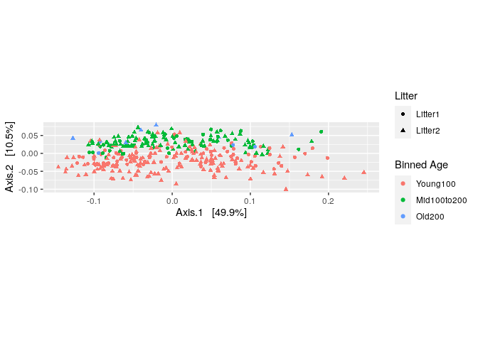<!-- -->

Le résultat est très similaire à celui de la DPCoA, ce qui s’explique du
fait que tous les deux sont des ordinations phylogénetiques tenant en
compte l’abondance. Cependant la DPCoA permettait une analyse plus
claire de la dissimilarité de l’axe1.

### PCA par rangs

Afin de tracer une PCA qui ne se soit pas vue affectée par la
normalisation de façon négative (observation atypiques possibles), on va
créer des rangs. Ces rangs vont servir par la suite à tracer la PCA qui
va nous permettre de travailler avec des rangs de variables au lieu des
valeurs observées.Ainsi on crée les rangs en fonction des abondances au
sein des microbiomes.

``` r
abund <- otu_table(pslog)
abund_ranks <- t(apply(abund, 1, rank))

abund_ranks <- abund_ranks - 329
abund_ranks[abund_ranks < 1] <- 1
```

On crée une matrice abund\_df dans laquelle on va retrouver l’union de
abund et à gauche une colonne avec les valeurs de abund\_ranks. On
attribue aux noms des colonnes de cette matrice, en ordre, Sample pour
les échantillons; seq pour la séquence de l’échantillon; abun pour
l’abondance tirée des OTU; et rank pour le rang attribué à
l’abondance. Ensuite on prépare un graphique nous permettant d’évaluer
l’assignation des rangs en fonction de l’abondance et qu’il n’y ait pas
de disparité à cause des points moins abondants (regroupés en 1 pour
éviter l’effet horseshoe). On crée un objet sample\_ix qui va permettre
de récuperer de façon aléatoire 8 échantillons dès la première ligne
jusqu’à la dernière ligne où il y a une abondance assignée. Ensuite on
trace le graphique en fonction de l’abondance et en filtrant nos
échantillons de abund\_df par ordre croissant d’abondance. Ensuite on
donne les instructions ésthetiques du graphique. Et on met des
étiquettes pour différentier les échantillons (les couleurs des points
vont varier en fonction de l’échantillon). La graphique va être tracée
de façon a observer les variations de rang en fonction de l’abondance
sur ces 8 échantillons aléatoires.

``` r
library(dplyr)
```

    ## 
    ## Attaching package: 'dplyr'

    ## The following object is masked from 'package:gridExtra':
    ## 
    ##     combine

    ## The following objects are masked from 'package:Biostrings':
    ## 
    ##     collapse, intersect, setdiff, setequal, union

    ## The following object is masked from 'package:XVector':
    ## 
    ##     slice

    ## The following objects are masked from 'package:IRanges':
    ## 
    ##     collapse, desc, intersect, setdiff, slice, union

    ## The following objects are masked from 'package:S4Vectors':
    ## 
    ##     first, intersect, rename, setdiff, setequal, union

    ## The following objects are masked from 'package:BiocGenerics':
    ## 
    ##     combine, intersect, setdiff, union

    ## The following objects are masked from 'package:stats':
    ## 
    ##     filter, lag

    ## The following objects are masked from 'package:base':
    ## 
    ##     intersect, setdiff, setequal, union

``` r
library(reshape2)
abund_df <- melt(abund, value.name = "abund") %>%
  left_join(melt(abund_ranks, value.name = "rank"))
```

    ## Joining, by = c("Var1", "Var2")

``` r
colnames(abund_df) <- c("sample", "seq", "abund", "rank")

abund_df <- melt(abund, value.name = "abund") %>%
  left_join(melt(abund_ranks, value.name = "rank"))
```

    ## Joining, by = c("Var1", "Var2")

``` r
colnames(abund_df) <- c("sample", "seq", "abund", "rank")

sample_ix <- sample(1:nrow(abund_df), 8)
ggplot(abund_df %>%
         filter(sample %in% abund_df$sample[sample_ix])) +
  geom_point(aes(x = abund, y = rank, col = sample),
             position = position_jitter(width = 0.2), size = 1.5) +
  labs(x = "Abundance", y = "Thresholded rank") +
  scale_color_brewer(palette = "Set2")
```

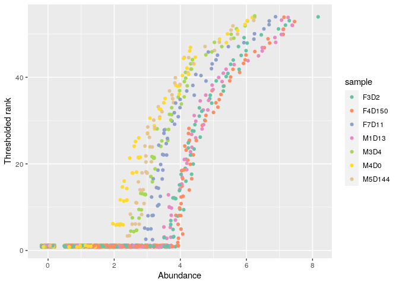<!-- -->

On est prêts pour tracer la PCA. Pour ce faire, grâce à la fonction
dudi.pca on crée un objet PCA à partir des données stockées sur
abund\_ranks. On indique que l’on veut conserver 3 axes sur cette PCA
(nf). On crée une data frame dans laquelle on va avoir les coordonnées
sur les trois axes de chaque échantillon. On rajoute sur cette table
l’ID de l’échantillon à partir des rangées de la table d’abund\_ranks.
Ensuite on crée une table contenant les scores (et donc coordonnées
aussi) en fonction des colonnes, on tire dans ce cas ci les séquences
(colonnes) de la table abund\_ranks. Puis on crée une data frame à
partir de la table taxonomique de l’objet phyloseq. On définit grâce aux
row names (les séquences) une colonne contenant ces séquences. Ensuite
on défini un objet main\_orders dans lequel on va englober les
Clostridiales; Bacteriodales; Lactobacillales et les Coriobacteriales
qui sont les ordres ayant des abondances plus importantes. Cet objet
permet par la suite d’assigner au reste des ordres le mot “others”, cela
permet à son tour de classer les données de tax entre les ordres
d’importance et les “autres” moins abondants. Ensuite on assigne à la
table row\_score les données de ps\_log à gauche des données que l’on
avait déjà assigné sur row\_score. Et on fait de même avec col\_scores
mais en rajoutant la table tax.

``` r
library(ade4)
```

    ## 
    ## Attaching package: 'ade4'

    ## The following object is masked from 'package:Biostrings':
    ## 
    ##     score

    ## The following object is masked from 'package:BiocGenerics':
    ## 
    ##     score

``` r
ranks_pca <- dudi.pca(abund_ranks, scannf = F, nf = 3)
row_scores <- data.frame(li = ranks_pca$li,
                         SampleID = rownames(abund_ranks))
col_scores <- data.frame(co = ranks_pca$co,
                         seq = colnames(abund_ranks))
tax <- tax_table(ps) %>%
  data.frame(stringsAsFactors = FALSE)
tax$seq <- rownames(tax)
main_orders <- c("Clostridiales", "Bacteroidales", "Lactobacillales",
                 "Coriobacteriales")
tax$Order[!(tax$Order %in% main_orders)] <- "Other"
tax$Order <- factor(tax$Order, levels = c(main_orders, "Other"))
tax$otu_id <- seq_len(ncol(otu_table(ps)))
row_scores <- row_scores %>%
  left_join(sample_data(pslog))
```

    ## Joining, by = "SampleID"

    ## Warning in class(x) <- c(setdiff(subclass, tibble_class), tibble_class): Setting
    ## class(x) to multiple strings ("tbl_df", "tbl", ...); result will no longer be an
    ## S4 object

``` r
col_scores <- col_scores %>%
  left_join(tax)
```

    ## Joining, by = "seq"

On transforme les fréquences en pourcentages de proportionnalité et on
donne les instructions pour construire la PCA de façon graphique. On
utilise des triangles pour analyser les points par rapport aux données
de la table row\_scores et des points pour col\_scores. On trace trois
PCA différentes en fonction du groupe d’âge pour voir d’autres
paramètres jouant sur les échantillons; on utilise des couleurs en
fonction de l’ordre (pour l’analyse des colonnes). Ainsi grâce aux
colonnes on étudie la similarité/dissimilarité des échantillons à partir
des groupements taxonomiques et leur séquence. Alors que à travers la
table row (tangées) on étudie la dissimilarité à partir des facteurs
d’échantillonnage (sexe de la souris; parenté entre les souris;
échantillon duquel est issue la séquence…).

``` r
evals_prop <- 100 * (ranks_pca$eig / sum(ranks_pca$eig))
ggplot() +
  geom_point(data = row_scores, aes(x = li.Axis1, y = li.Axis2), shape = 2) +
  geom_point(data = col_scores, aes(x = 25 * co.Comp1, y = 25 * co.Comp2, col = Order),
             size = .3, alpha = 0.6) +
  scale_color_brewer(palette = "Set2") +
  facet_grid(~ age_binned) +
  guides(col = guide_legend(override.aes = list(size = 3))) +
  labs(x = sprintf("Axis1 [%s%% variance]", round(evals_prop[1], 2)),
       y = sprintf("Axis2 [%s%% variance]", round(evals_prop[2], 2))) +
  coord_fixed(sqrt(ranks_pca$eig[2] / ranks_pca$eig[1])) +
  theme(panel.border = element_rect(color = "#787878", fill = alpha("white", 0)))
```

<!-- -->

Sur les graphiques obtenus on voit des groupements de triangles
abondants et pas une très grande différence ou distribution de ces
points. Cependant quand on étudie les échantillons à travers les points
(circulaires et qui correspondent donc aux scores obtenus pour l’étude
de similarité/dissimilarité à travers les études de séquence et
taxonomique) on voit une plus grande distribution des points. De la même
façon on observe certains groupements dépendant de l’ordre taxonomique
(les bacteroidales par exemple). Cette conclusion et analyse est
semblable à celui que l’on a déjà fait précédamment. Cela permet de
confirmer (ou en tout cas renforcer) notre théorie du premier analyse.

### Analyse de correspondance canonique (CCA).

L’analyse de correspondance canonique est une autre méthode
d’ordination. Cette méthode permet d’évaluer encore plus de facteurs
pouvant affecter à la similarité/dissimilarité des échantillons. Ainsi
ici on va pouvoir placer graphiquement les échantillons en contion de
l’âge et de leur littière mais aussi par rapport aux données stoquées
sur pslog (donc OTUs).

``` r
ps_ccpna <- ordinate(pslog, "CCA", formula = pslog ~ age_binned + family_relationship)
library(ggrepel)
ps_scores <- vegan::scores(ps_ccpna)
sites <- data.frame(ps_scores$sites)
sites$SampleID <- rownames(sites)
sites <- sites %>%
  left_join(sample_data(ps))
```

    ## Joining, by = "SampleID"

    ## Warning in class(x) <- c(setdiff(subclass, tibble_class), tibble_class): Setting
    ## class(x) to multiple strings ("tbl_df", "tbl", ...); result will no longer be an
    ## S4 object

``` r
species <- data.frame(ps_scores$species)
species$otu_id <- seq_along(colnames(otu_table(ps)))
species <- species %>%
  left_join(tax)
```

    ## Joining, by = "otu_id"

``` r
evals_prop <- 100 * ps_ccpna$CCA$eig[1:2] / sum(ps_ccpna$CA$eig)
ggplot() +
  geom_point(data = sites, aes(x = CCA1, y = CCA2), shape = 2, alpha = 0.5) +
  geom_point(data = species, aes(x = CCA1, y = CCA2, col = Order), size = 0.5) +
  geom_text_repel(data = species %>% filter(CCA2 < -2),
                    aes(x = CCA1, y = CCA2, label = otu_id),
            size = 1.5, segment.size = 0.1) +
  facet_grid(. ~ family_relationship) +
  guides(col = guide_legend(override.aes = list(size = 3))) +
  labs(x = sprintf("Axis1 [%s%% variance]", round(evals_prop[1], 2)),
        y = sprintf("Axis2 [%s%% variance]", round(evals_prop[2], 2))) +
  scale_color_brewer(palette = "Set2") +
  coord_fixed(sqrt(ps_ccpna$CCA$eig[2] / ps_ccpna$CCA$eig[1])*0.45   ) +
  theme(panel.border = element_rect(color = "#787878", fill = alpha("white", 0)))
```

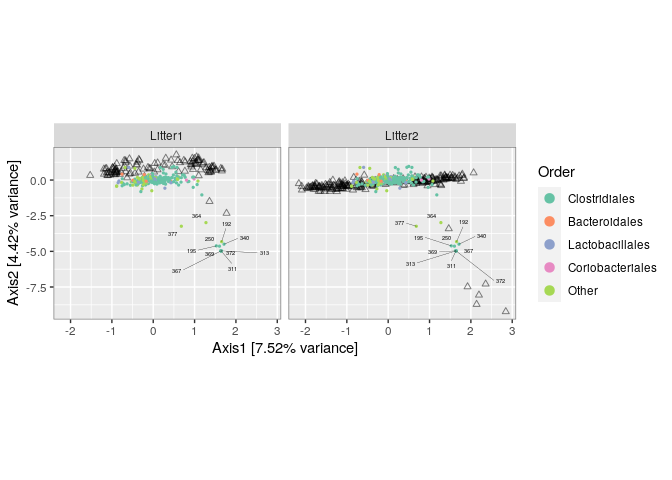<!-- -->

``` r
library(caret)
```

    ## Loading required package: lattice

``` r
library(lattice)
sample_data(pslog)$age2 <- cut(sample_data(pslog)$age, c(0, 100, 400))
dataMatrix <- data.frame(age = sample_data(pslog)$age2, otu_table(pslog))
# take 8 mice at random to be the training set, and the remaining 4 the test set
trainingMice <- sample(unique(sample_data(pslog)$host_subject_id), size = 8)
inTrain <- which(sample_data(pslog)$host_subject_id %in% trainingMice)
training <- dataMatrix[inTrain,]
testing <- dataMatrix[-inTrain,]
plsFit <- train(age ~ ., data = training,
                method = "pls", preProc = "center")
plsClasses <- predict(plsFit, newdata = testing)
table(plsClasses, testing$age)
```

    ##            
    ## plsClasses  (0,100] (100,400]
    ##   (0,100]        69         0
    ##   (100,400]       3        47

``` r
library(randomForest)
```

    ## randomForest 4.6-14

    ## Type rfNews() to see new features/changes/bug fixes.

    ## 
    ## Attaching package: 'randomForest'

    ## The following object is masked from 'package:dplyr':
    ## 
    ##     combine

    ## The following object is masked from 'package:gridExtra':
    ## 
    ##     combine

    ## The following object is masked from 'package:ggplot2':
    ## 
    ##     margin

    ## The following object is masked from 'package:BiocGenerics':
    ## 
    ##     combine

``` r
library(dplyr)
library(gridExtra)
library(ggplot2)
library(BiocGenerics)
rfFit <- train(age ~ ., data = training, method = "rf",
               preProc = "center", proximity = TRUE)
rfClasses <- predict(rfFit, newdata = testing)
table(rfClasses, testing$age)
```

    ##            
    ## rfClasses   (0,100] (100,400]
    ##   (0,100]        70         7
    ##   (100,400]       2        40

``` r
library(vegan)
```

    ## Loading required package: permute

    ## This is vegan 2.5-6

    ## 
    ## Attaching package: 'vegan'

    ## The following object is masked from 'package:caret':
    ## 
    ##     tolerance

    ## The following objects are masked from 'package:phangorn':
    ## 
    ##     diversity, treedist

``` r
pls_biplot <- list("loadings" = loadings(plsFit$finalModel),
                   "scores" = scores(plsFit$finalModel))
class(pls_biplot$scores) <- "matrix"

pls_biplot$scores <- data.frame(sample_data(pslog)[inTrain, ],
                                pls_biplot$scores)

tax <- tax_table(ps)@.Data %>%
  data.frame(stringsAsFactors = FALSE)
main_orders <- c("Clostridiales", "Bacteroidales", "Lactobacillales",
                 "Coriobacteriales")
tax$Order[!(tax$Order %in% main_orders)] <- "Other"
tax$Order <- factor(tax$Order, levels = c(main_orders, "Other"))
class(pls_biplot$loadings) <- "matrix"
pls_biplot$loadings <- data.frame(tax, pls_biplot$loadings)
ggplot() +
  geom_point(data = pls_biplot$scores,
             aes(x = Comp.1, y = Comp.2), shape = 2) +
  geom_point(data = pls_biplot$loadings,
             aes(x = 25 * Comp.1, y = 25 * Comp.2, col = Order),
             size = 0.3, alpha = 0.6) +
  scale_color_brewer(palette = "Set2") +
  labs(x = "Axis1", y = "Axis2", col = "Binned Age") +
  guides(col = guide_legend(override.aes = list(size = 3))) +
  facet_grid( ~ age2) +
  theme(panel.border = element_rect(color = "#787878", fill = alpha("white", 0)))
```

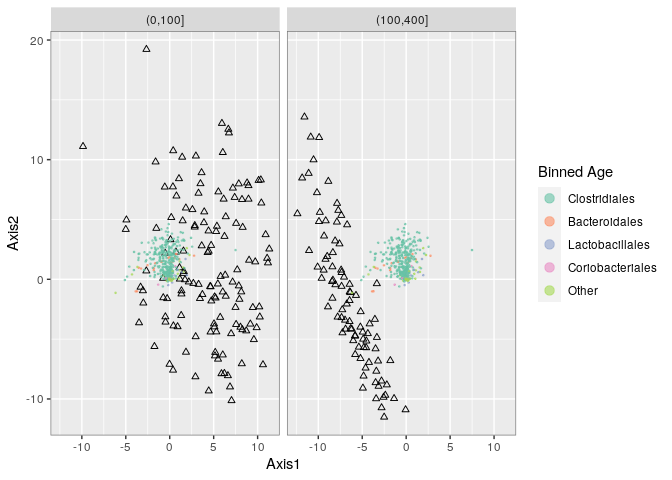<!-- -->

``` r
rf_prox <- cmdscale(1 - rfFit$finalModel$proximity) %>%
  data.frame(sample_data(pslog)[inTrain, ])

ggplot(rf_prox) +
  geom_point(aes(x = X1, y = X2, col = age_binned),
             size = 1, alpha = 0.7) +
  scale_color_manual(values = c("#A66EB8", "#238DB5", "#748B4F")) +
  guides(col = guide_legend(override.aes = list(size = 4))) +
  labs(col = "Binned Age", x = "Axis1", y = "Axis2")
```

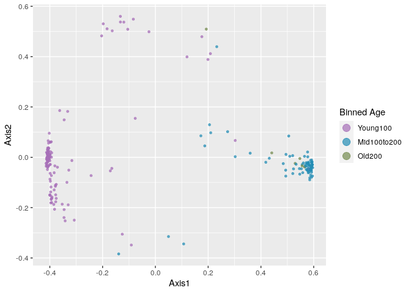<!-- -->

``` r
as.vector(tax_table(ps)[which.max(importance(rfFit$finalModel)), c("Family", "Genus")])
```

    ## [1] "Lachnospiraceae" "Roseburia"

``` r
impOtu <- as.vector(otu_table(pslog)[,which.max(importance(rfFit$finalModel))])
maxImpDF <- data.frame(sample_data(pslog), abund = impOtu)
ggplot(maxImpDF) +   geom_histogram(aes(x = abund)) +
  facet_grid(age2 ~ .) +
  labs(x = "Abundance of discriminative bacteria", y = "Number of samples")
```

    ## `stat_bin()` using `bins = 30`. Pick better value with `binwidth`.

<!-- -->

# Analyses Graphiques.

En plus des analyses déjà effectuées, grâce à R on peut tracer des
graphiques dans lesquels on peut établir des connexions en se basant sur
la dissimilarité des échantillons. Ces graphiques on besoin de formes ou
ajouts géometriques, et c’est grâce au package ggnetwork que l’on peut
créer ces liens comme des coudes ou des noeuds afin de mieux représenter
les liaisons. On installe et charge plusieurs packages qui vont nous
permettre d’accomplir ces fonctions.

``` r
library("phyloseqGraphTest")
library("igraph")
```

    ## 
    ## Attaching package: 'igraph'

    ## The following object is masked from 'package:vegan':
    ## 
    ##     diversity

    ## The following object is masked from 'package:permute':
    ## 
    ##     permute

    ## The following objects are masked from 'package:dplyr':
    ## 
    ##     as_data_frame, groups, union

    ## The following object is masked from 'package:phangorn':
    ## 
    ##     diversity

    ## The following objects are masked from 'package:ape':
    ## 
    ##     edges, mst, ring

    ## The following object is masked from 'package:Biostrings':
    ## 
    ##     union

    ## The following object is masked from 'package:IRanges':
    ## 
    ##     union

    ## The following object is masked from 'package:S4Vectors':
    ## 
    ##     union

    ## The following objects are masked from 'package:BiocGenerics':
    ## 
    ##     normalize, path, union

    ## The following objects are masked from 'package:stats':
    ## 
    ##     decompose, spectrum

    ## The following object is masked from 'package:base':
    ## 
    ##     union

``` r
library("ggnetwork")
library(vegan)
library(permute)
library(dplyr)
library(phangorn)
library(ape)
library(Biostrings)
library(IRanges)
library(S4Vectors)
library(BiocGenerics)
library(stats)
library(base)
```

Nous allons travailler ici sur les liaisons concernant les souris, et la
dissimilarité/similarité entre elles compte tenu de leur échantillon et
de leur littière. Nous allons commencer par créer un graphique en réseau
à l’aide de la fonction make\_network du package ggnetwork. On crée ce
réseau à partir des données de ps et en acceptant un seuil d’indice de
Jacquard de 0,35. Ensuite on extrait les données stoquées dans la table
de données de ps et on les utilise pour définir comment joindre les
divers points, en fonction de la littière de porvenance ainsi que de
l’échantillon duquel proviens chaque point. Les nodes sont ainsi
définis par les formes et couleurs et les lignes liant les nodes
(bordures ou “edges”) sont tracées en gris foncé.

``` r
net <- make_network(ps, max.dist=0.35)
sampledata <- data.frame(sample_data(ps))
V(net)$id <- sampledata[names(V(net)), "host_subject_id"]
V(net)$litter <- sampledata[names(V(net)), "family_relationship"]

net_graph<-ggnetwork(net)

ggplot(net_graph, aes(x = x, y = y, xend = xend, yend = yend), layout = "fruchtermanreingold") +
  geom_edges(color = "darkgray") +
  geom_nodes(aes(color = id, shape = litter),  size = 3 ) +
  theme(axis.text = element_blank(), axis.title = element_blank(),
        legend.key.height = unit(0.5,"line")) +
  guides(col = guide_legend(override.aes = list(size = .5)))
```

<!-- -->

Ce graphique nous permet voir à travers le réseau on voit que les points
de la même couleur ont une tendance à être réliés entre eux, de la même
façon les points appartenant à la littière 1 sont liés majeurement entre
eux et ceux de la littière deux entre eux. On voit donc deux possibles
façons de regroupement. On voit aussi et notamment un lien entre la
couleur et la forme, indiquant que tous les échantillons d’un type
provienent de la même littière.

## Graphiques comparant deux tests

Sur ces graphiques on va chercher à connecter les diverses souris en
effectuant des itérations à chaque fois pour s’assurer d’être entrain de
tracer le plus court chemin, et le meilleur chemin pour connecter les
souris plus similaires entre elles.

### Minimum Spanning Tree (MST)

Sur cette méthode on utilise l’indice de Jaccard afin de situer les
souris les unes par rapport aux autres. Ensuite l’arbre est rtacé de
façon à cumuler le moins de différence possible en additionnant les
indices.

``` r
gt <- graph_perm_test(ps, "family_relationship", grouping = "host_subject_id",
                      distance = "jaccard", type = "mst")
gt$pval
```

    ## [1] 0.004

``` r
plotNet1=plot_test_network(gt) + theme(legend.text = element_text(size = 8),
        legend.title = element_text(size = 9))
plotPerm1=plot_permutations(gt)
grid.arrange(ncol = 2,  plotNet1, plotPerm1)
```

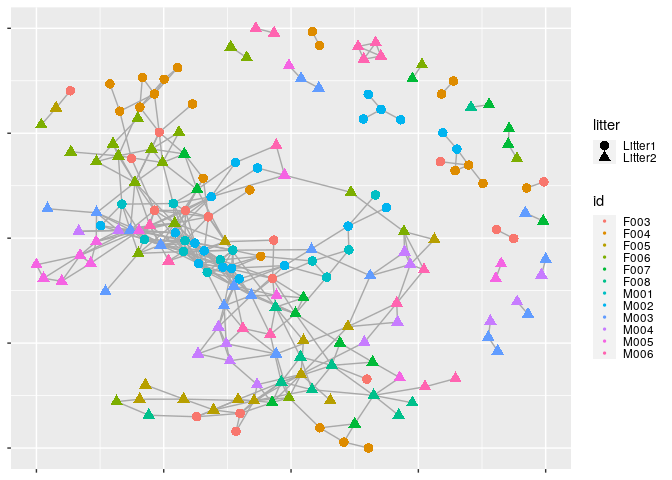<!-- -->

Grâce à ce graphique et notamment à sa contruction on peut créer un
graphique de distribution des permutations en fonction du nombre
d’angles purs qui permettent de créer l’arbre.

## Neighbors joining

Cette méthode commence par lier deux échantillons entre eux et ensuite
recalcule les indices de dissimilarité afin de joindre à

``` r
gt <- graph_perm_test(ps, "family_relationship", grouping = "host_subject_id",
                      distance = "jaccard", type = "knn", knn = 1)
plotNet2=plot_test_network(gt) + theme(legend.text = element_text(size = 8),
        legend.title = element_text(size = 9))
plotPerm2=plot_permutations(gt)
grid.arrange(ncol = 2,  plotNet2, plotPerm2)
```

<!-- -->

\#Linear modeling: Unlike ordination, the purpose of this analysis is
not to develop a representation of many bacteria with respect to sample
characteristics; rather, it is to describe how a single measure of
overall community structure\[^1\] is associated with sample
characteristics.

\#\#mixed-effects model to study the relationship between mouse
microbial community diversity and the age and litter variables that have
been our focus so far.

\#\#\#We first compute the Shannon diversity associated with each sample
and join it with sample annotation.

``` r
library("nlme")
```

    ## 
    ## Attaching package: 'nlme'

    ## The following object is masked from 'package:dplyr':
    ## 
    ##     collapse

    ## The following object is masked from 'package:Biostrings':
    ## 
    ##     collapse

    ## The following object is masked from 'package:IRanges':
    ## 
    ##     collapse

``` r
library("reshape2")
ps_alpha_div <- estimate_richness(ps, split = TRUE, measure = "Shannon")
ps_alpha_div$SampleID <- rownames(ps_alpha_div) %>%
  as.factor()
ps_samp <- sample_data(ps) %>%
  unclass() %>%
  data.frame() %>%
  left_join(ps_alpha_div, by = "SampleID") %>%
  melt(measure.vars = "Shannon",
       variable.name = "diversity_measure",
       value.name = "alpha_diversity")

# reorder's facet from lowest to highest diversity
diversity_means <- ps_samp %>%
  group_by(host_subject_id) %>%
  summarise(mean_div = mean(alpha_diversity)) %>%
  arrange(mean_div)
```

    ## `summarise()` ungrouping output (override with `.groups` argument)

``` r
ps_samp$host_subject_id <- factor(ps_samp$host_subject_id)
#                                  diversity_means$host_subject_id)
alpha_div_model <- lme(fixed = alpha_diversity ~ age_binned, data = ps_samp,
                       random = ~ 1 | host_subject_id)
new_data <- expand.grid(host_subject_id = levels(ps_samp$host_subject_id),
                        age_binned = levels(ps_samp$age_binned))
new_data$pred <- predict(alpha_div_model, newdata = new_data)
X <- model.matrix(eval(eval(alpha_div_model$call$fixed)[-2]),
                  new_data[-ncol(new_data)])
pred_var_fixed <- diag(X %*% alpha_div_model$varFix %*% t(X))
new_data$pred_var <- pred_var_fixed + alpha_div_model$sigma ^ 2
# fitted values, with error bars
ggplot(ps_samp %>% left_join(new_data)) +
  geom_errorbar(aes(x = age_binned, ymin = pred - 2 * sqrt(pred_var),
                    ymax = pred + 2 * sqrt(pred_var)),
                col = "#858585", size = .1) +
  geom_point(aes(x = age_binned, y = alpha_diversity,
                 col = family_relationship), size = 0.8) +
  facet_wrap(~host_subject_id) +
  scale_y_continuous(limits = c(2.4, 4.6), breaks = seq(0, 5, .5)) +
  scale_color_brewer(palette = "Set2") +
  labs(x = "Binned Age", y = "Shannon Diversity", color = "Litter") +
  guides(col = guide_legend(override.aes = list(size = 4))) +
  theme(panel.border = element_rect(color = "#787878", fill = alpha("white", 0)),
        axis.text.x = element_text(angle = -90, size = 6),
        axis.text.y = element_text(size = 6))
```

    ## Joining, by = c("host_subject_id", "age_binned")

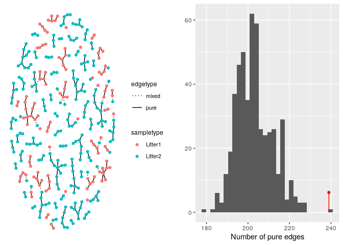<!-- -->

\#Hierarchical multiple testing

``` r
library("reshape2")
if(!requireNamespace("BiocManager",quietly=TRUE)) install.packages("BiocManager")
BiocManager::install("DESeq2")
```

    ## Bioconductor version 3.11 (BiocManager 1.30.10), R 4.0.3 (2020-10-10)

    ## Installing package(s) 'DESeq2'

    ## Installation path not writeable, unable to update packages: codetools,
    ##   KernSmooth, nlme

    ## Old packages: 'gh', 'isoband', 'processx', 'rlang', 'vegan'

``` r
library("DESeq2")
```

    ## Loading required package: GenomicRanges

    ## Loading required package: GenomeInfoDb

    ## Loading required package: SummarizedExperiment

    ## Loading required package: Biobase

    ## Welcome to Bioconductor
    ## 
    ##     Vignettes contain introductory material; view with
    ##     'browseVignettes()'. To cite Bioconductor, see
    ##     'citation("Biobase")', and for packages 'citation("pkgname")'.

    ## 
    ## Attaching package: 'Biobase'

    ## The following object is masked from 'package:phyloseq':
    ## 
    ##     sampleNames

    ## Loading required package: DelayedArray

    ## Loading required package: matrixStats

    ## 
    ## Attaching package: 'matrixStats'

    ## The following objects are masked from 'package:Biobase':
    ## 
    ##     anyMissing, rowMedians

    ## The following object is masked from 'package:dplyr':
    ## 
    ##     count

    ## 
    ## Attaching package: 'DelayedArray'

    ## The following objects are masked from 'package:matrixStats':
    ## 
    ##     colMaxs, colMins, colRanges, rowMaxs, rowMins, rowRanges

    ## The following object is masked from 'package:igraph':
    ## 
    ##     simplify

    ## The following objects are masked from 'package:base':
    ## 
    ##     aperm, apply, rowsum

``` r
#New version of DESeq2 needs special levels
sample_data(ps)$age_binned <- cut(sample_data(ps)$age,
                          breaks = c(0, 100, 200, 400))
levels(sample_data(ps)$age_binned) <- list(Young100="(0,100]", Mid100to200="(100,200]", Old200="(200,400]")
sample_data(ps)$family_relationship = gsub(" ", "", sample_data(ps)$family_relationship)
ps_dds <- phyloseq_to_deseq2(ps, design = ~ age_binned + family_relationship)
```

    ## converting counts to integer mode

    ## Warning in DESeqDataSet(se, design = design, ignoreRank): some variables in
    ## design formula are characters, converting to factors

``` r
# geometric mean, set to zero when all coordinates are zero
geo_mean_protected <- function(x) {
  if (all(x == 0)) {
    return (0)
  }
  exp(mean(log(x[x != 0])))
}

geoMeans <- apply(counts(ps_dds), 1, geo_mean_protected)
ps_dds <- estimateSizeFactors(ps_dds, geoMeans = geoMeans)
ps_dds <- estimateDispersions(ps_dds)
```

    ## gene-wise dispersion estimates

    ## mean-dispersion relationship

    ## final dispersion estimates

``` r
abund <- getVarianceStabilizedData(ps_dds)

short_names <- substr(rownames(abund), 1, 5)%>%
  make.names(unique = TRUE)
rownames(abund) <- short_names

abund_sums <- rbind(data.frame(sum = colSums(abund),
                               sample = colnames(abund),
                               type = "DESeq2"),
                    data.frame(sum = rowSums(otu_table(pslog)),
                               sample = rownames(otu_table(pslog)),
                               type = "log(1 + x)"))

ggplot(abund_sums) +
  geom_histogram(aes(x = sum), binwidth = 20) +
  facet_grid(type ~ .) +
  xlab("Total abundance within sample")
```

<!-- -->

``` r
library("structSSI")
el <- phy_tree(pslog)$edge
el0 <- el
el0 <- el0[nrow(el):1, ]
el_names <- c(short_names, seq_len(phy_tree(pslog)$Nnode))
el[, 1] <- el_names[el0[, 1]]
el[, 2] <- el_names[as.numeric(el0[, 2])]
unadj_p <- treePValues(el, abund, sample_data(pslog)$age_binned)

hfdr_res <- hFDR.adjust(unadj_p, el, .75)
summary(hfdr_res)
```

    ## Number of hypotheses: 764 
    ## Number of tree discoveries: 579 
    ## Estimated tree FDR: 1 
    ## Number of tip discoveries: 280 
    ## Estimated tips FDR: 1 
    ## 
    ##  hFDR adjusted p-values: 
    ##                 unadjp         adjp adj.significance
    ## GCAAG.95  1.861873e-82 3.723745e-82              ***
    ## GCAAG.70  1.131975e-75 2.263950e-75              ***
    ## GCAAG.187 5.148758e-59 1.029752e-58              ***
    ## GCAAG.251 3.519276e-50 7.038553e-50              ***
    ## GCAAG.148 1.274481e-49 2.548962e-49              ***
    ## GCAAG.30  9.925218e-49 1.985044e-48              ***
    ## GCGAG.76  1.722591e-46 3.445183e-46              ***
    ## GCAAG.167 6.249050e-43 1.249810e-42              ***
    ## 255       8.785479e-40 1.757096e-39              ***
    ## GCAAG.64  2.727610e-36 5.455219e-36              ***
    ## [only 10 most significant hypotheses shown] 
    ## --- 
    ## Signif. codes:  0 '***' 0.015 '**' 0.15 '*' 0.75 '.' 1.5 '-' 1

``` r
plot(hfdr_res, height = 5000) #opens in a browser
```

``` r
tax <- tax_table(pslog)[, c("Family", "Genus")] %>%
  data.frame()
tax$seq <- short_names
options(digits=3)
hfdr_res@p.vals$seq <- rownames(hfdr_res@p.vals)
tax %>%
  left_join(hfdr_res@p.vals) %>%
  arrange(adjp) %>% head(10)
```

    ## Joining, by = "seq"

    ##             Family            Genus       seq   unadjp     adjp
    ## 1  Lachnospiraceae             <NA>  GCAAG.95 1.86e-82 3.72e-82
    ## 2  Lachnospiraceae        Roseburia  GCAAG.70 1.13e-75 2.26e-75
    ## 3  Lachnospiraceae Clostridium_XlVa GCAAG.187 5.15e-59 1.03e-58
    ## 4  Lachnospiraceae             <NA> GCAAG.251 3.52e-50 7.04e-50
    ## 5  Lachnospiraceae Clostridium_XlVa GCAAG.148 1.27e-49 2.55e-49
    ## 6  Lachnospiraceae             <NA>  GCAAG.30 9.93e-49 1.99e-48
    ## 7  Ruminococcaceae     Ruminococcus  GCGAG.76 1.72e-46 3.45e-46
    ## 8  Lachnospiraceae Clostridium_XlVa GCAAG.167 6.25e-43 1.25e-42
    ## 9  Lachnospiraceae        Roseburia  GCAAG.64 2.73e-36 5.46e-36
    ## 10            <NA>             <NA>   GCAAG.1 5.22e-35 1.04e-34
    ##    adj.significance
    ## 1               ***
    ## 2               ***
    ## 3               ***
    ## 4               ***
    ## 5               ***
    ## 6               ***
    ## 7               ***
    ## 8               ***
    ## 9               ***
    ## 10              ***

\#Multitable techniques

``` r
metab <- read.csv("https://raw.githubusercontent.com/spholmes/F1000_workflow/master/data/metabolites.csv",row.names = 1)
microbe_connect <-url("https://raw.githubusercontent.com/spholmes/F1000_workflow/master/data/microbe.rda")
load(microbe_connect)
microbe
```

    ## phyloseq-class experiment-level object
    ## otu_table()   OTU Table:         [ 20609 taxa and 12 samples ]
    ## tax_table()   Taxonomy Table:    [ 20609 taxa by 6 taxonomic ranks ]
    ## phy_tree()    Phylogenetic Tree: [ 20609 tips and 20607 internal nodes ]

``` r
library("genefilter")
```

    ## 
    ## Attaching package: 'genefilter'

    ## The following objects are masked from 'package:matrixStats':
    ## 
    ##     rowSds, rowVars

``` r
library(matrixStats)
keep_ix <- rowSums(metab == 0) <= 3
metab <- metab[keep_ix, ]
microbe <- prune_taxa(taxa_sums(microbe) > 4, microbe)
microbe <- filter_taxa(microbe, filterfun(kOverA(3, 2)), TRUE)
metab <- log(1 + metab, base = 10)
X <- otu_table(microbe)
X[X > 50] <- 50
dim(X)
```

    ## [1] 174  12

``` r
#ligne deux de tableau:
dim(metab)
```

    ## [1] 405  12

``` r
library(PMA)
cca_res <- CCA(t(X),  t(metab), penaltyx = .15, penaltyz = .15)
```

    ## 123456789101112131415

``` r
cca_res
```

    ## Call: CCA(x = t(X), z = t(metab), penaltyx = 0.15, penaltyz = 0.15)
    ## 
    ## 
    ## Num non-zeros u's:  5 
    ## Num non-zeros v's:  15 
    ## Type of x:  standard 
    ## Type of z:  standard 
    ## Penalty for x: L1 bound is  0.15 
    ## Penalty for z: L1 bound is  0.15 
    ## Cor(Xu,Zv):  0.974

``` r
combined <- cbind(t(X[cca_res$u != 0, ]),
                  t(metab[cca_res$v != 0, ]))
pca_res <- dudi.pca(combined, scannf = F, nf = 3)
genotype <- substr(rownames(pca_res$li), 1, 2)
sample_type <- substr(rownames(pca_res$l1), 3, 4)
feature_type <- grepl("\\.", colnames(combined))
feature_type <- ifelse(feature_type, "Metabolite", "OTU")
sample_info <- data.frame(pca_res$li, genotype, sample_type)
feature_info <- data.frame(pca_res$c1,
                           feature = substr(colnames(combined), 1, 6))
ggplot() +  geom_point(data = sample_info,
            aes(x = Axis1, y = Axis2, col = sample_type, shape = genotype), size = 3) + 
  geom_label_repel(data = feature_info,
                   aes(x = 5.5 * CS1, y = 5.5 * CS2, label = feature, fill = feature_type),
                   size = 2, segment.size = 0.3,
                   label.padding = unit(0.1, "lines"), label.size = 0) +
  geom_point(data = feature_info,
             aes(x = 5.5 * CS1, y = 5.5 * CS2, fill = feature_type),
             size = 1, shape = 23, col = "#383838") +
  scale_color_brewer(palette = "Set2") +
  scale_fill_manual(values = c("#a6d854", "#e78ac3")) +
  guides(fill = guide_legend(override.aes = list(shape = 32, size = 0))) +
  coord_fixed(sqrt(pca_res$eig[2] / pca_res$eig[2])) +
  labs(x = sprintf("Axis1 [%s%% Variance]",
                   100 * round(pca_res$eig[1] / sum(pca_res$eig), 2)),
       y = sprintf("Axis2 [%s%% Variance]",
                   100 * round(pca_res$eig[2] / sum(pca_res$eig), 2)),
       fill = "Feature Type", col = "Sample Type")
```

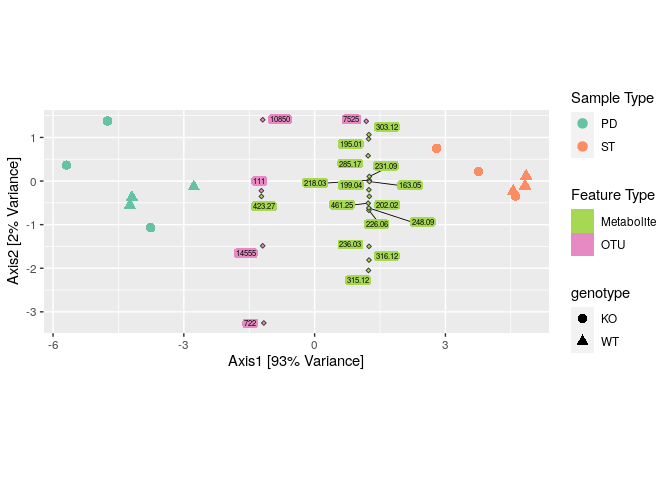<!-- -->
